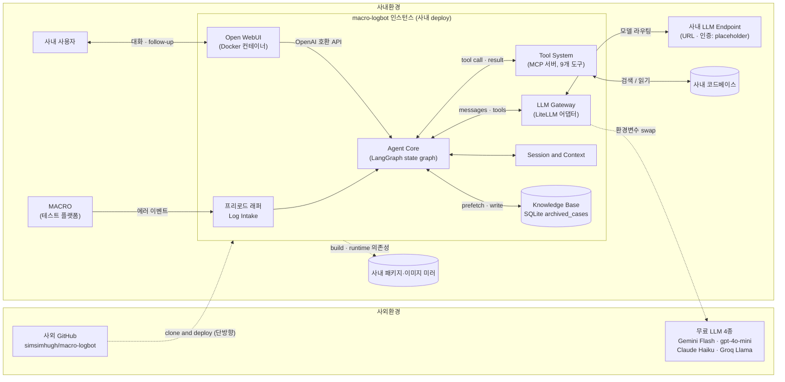
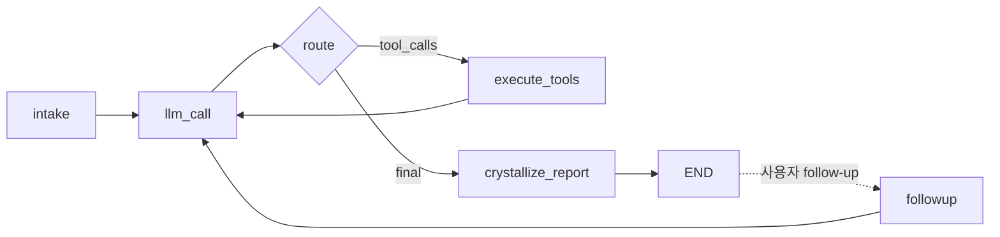
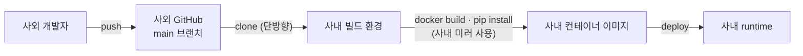
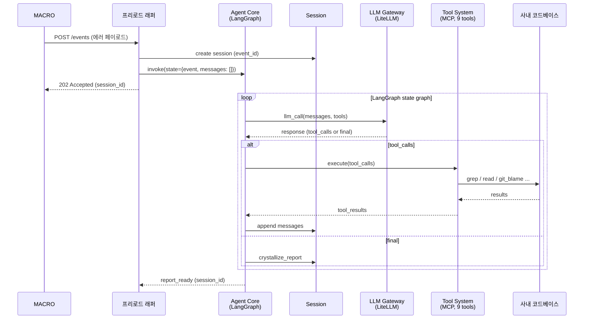
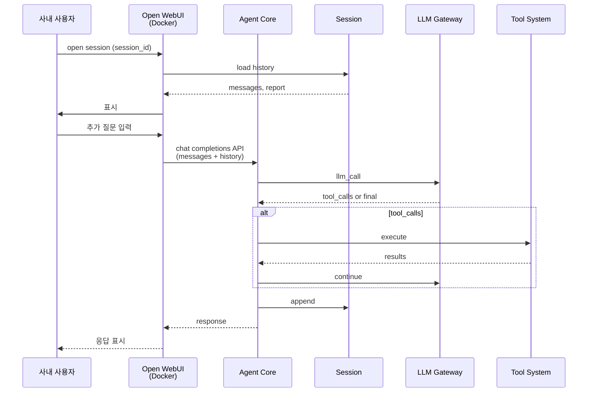
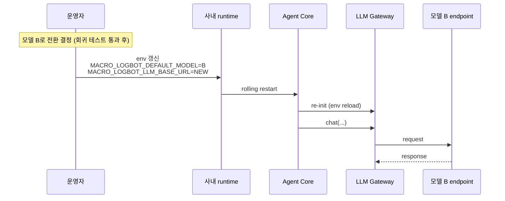
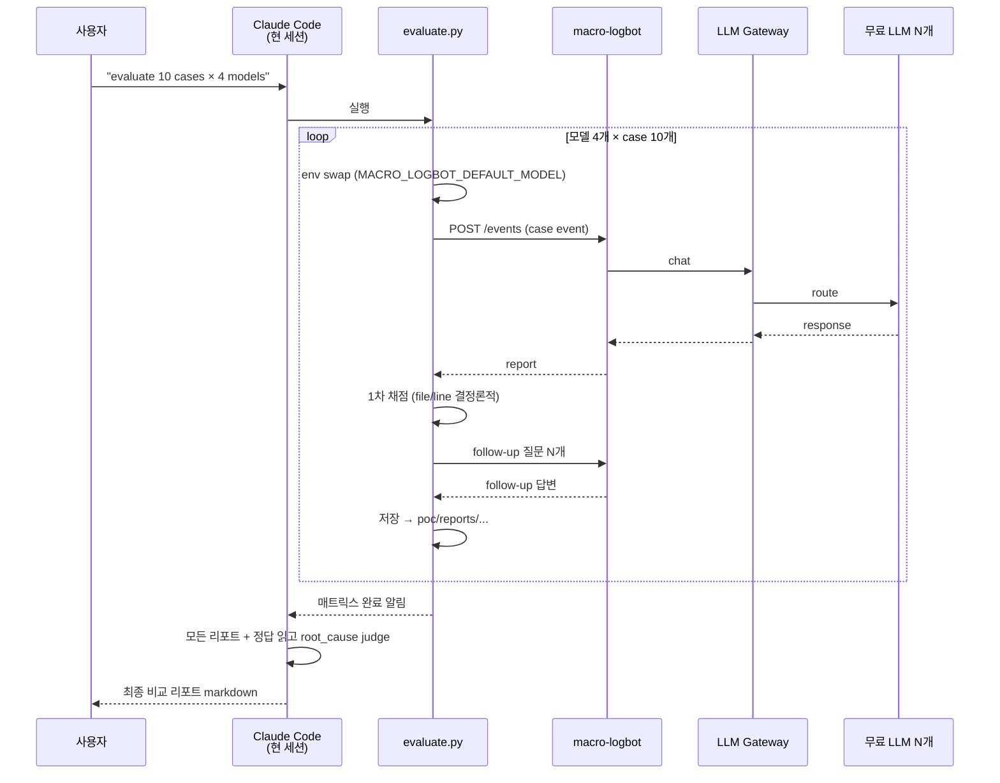
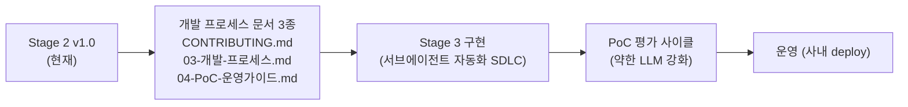

# 설계 문서: macro-logbot

## 1. 문서 정보
| 항목 | 내용 |
|---|---|
| 프로젝트명 | macro-logbot |
| 단계 | Stage 2/3 — 설계 문서 |
| 버전 | 1.1 |
| 작성일 | 2026-05-18 |
| 작성자 | macro-logbot 프로젝트팀 |
| 선행 문서 | `docs/requirements/01-요구사항명세서.md` (Stage 1 v0.4) |
| 보조 문서 | `docs/requirements/02-사내-사전확인-체크리스트.md` (tmp/pre-design-checklist 브랜치) |
| 후속 문서 | `docs/process/03-개발-프로세스.md` · `docs/process/04-PoC-운영가이드.md` · `CONTRIBUTING.md` (Stage 3 진입 전 작성 예정) |

## 2. 개요 및 메타 정의

macro-logbot은 사내 테스트 플랫폼 **MACRO**의 에러 로그를 받아 자율적으로 원인 분석 리포트를 생성하는 사내 에이전트 AI 플랫폼이다.

본 프로젝트는 **두 개의 층**이 동시에 진행된다:

| 층 | 내용 |
|---|---|
| **제품 층 (Product)** | macro-logbot 시스템 자체를 SDLC로 구축 (Stage 1 요구사항 → Stage 2 설계 → Stage 3 구현 → 운영) |
| **메타 층 (Meta)** | 그 SDLC를 AI 서브에이전트 자동화로 점진 전환 (AI DLC) — Stage 3부터 적극 적용 |

따라서 macro-logbot은 **AI 시스템**이자 동시에 **AI DLC의 실증 사례**다. process 문서가 일관되게 동작하면 향후 사내 다른 AI 프로젝트에도 재사용 가능한 자산이 된다.

핵심 설계 원칙:
- **사외 GitHub 개발 → 사내 클론·운영** 단방향 흐름 (C-3 · C-5)
- **OSS 최대 활용 + 사내 환경 어댑터만 자체 개발**
- **LLM Gateway 어댑터 패턴** (LiteLLM)으로 모델·API 형식을 단일 인터페이스로 흡수 → NFR-4(모델 독립성) 자동 달성
- **환경별 의존성 소스 전환**을 설정만으로 가능하게 (NFR-6 · C-6)
- **"가장 약한 LLM에서도 정확도를 끌어올리는 시스템 엔지니어링"** — macro-logbot의 핵심 가치는 LLM 자체 능력이 아니라 (Tool 디자인 + 프롬프트 + agent loop + retrieval 전략) 으로 LLM을 보완하는 설계

## 3. 가정 (Assumptions)

| ID | 가정 | 상태 (v1.0 기준) | 근거 / 검증 절차 |
|---|---|---|---|
| AS-1 | 사내 LLM은 multi-turn tool calling을 fully 지원 | **사실상 확정** (사외 PoC에서 베이스라인 검증 예정) | 사내 Claude Code 동작 = 직접 증거 |
| AS-2 | 사내 LLM API 형식은 LiteLLM이 흡수 가능한 패턴 (OpenAI / Anthropic / OpenAI-호환 proxy / custom_provider) | 확정 — 형식 무관 | LiteLLM 100+ provider 지원, 어댑터 패턴 |
| AS-3 | LiteLLM이 사내 미러에서 설치 가능 | **검증됨** | `pip index versions litellm` 통과 |
| AS-4 | MACRO 운영팀이 macro-logbot이 지정한 송신 인터페이스(HTTP webhook default)에 맞춰 줌 | 확정 | Stage 1 인터뷰 시 사용자 진술 |
| AS-5 | 사내 미러 등록 절차로 누락 의존성 추가 가능 + 사내 S3 wheel fallback | 확정 | Stage 1 인터뷰 시 사용자 진술 |
| AS-6 | LangGraph (Agent Core framework) 사내 미러 가용 | **검증됨** | `pip index versions langgraph` 통과 |
| AS-7 | Open WebUI(사용자 채팅 UI)는 PyPI보다 Docker 이미지로 배포 (Python 3.14 호환성 문제 회피) | 확정 (대안 채택) | Open WebUI는 Python 3.11~3.12만 지원, 사용자 환경 Python 3.14. Docker 격리로 회피. 사내 운영 시 Docker registry 미러 가용성만 추가 확인 필요 |
| AS-8 | 사외 PoC 단계에서 Claude Code (본 세션)가 채점 judge로 작동 가능 | 확정 | 본 세션 자체가 강력한 judge LLM. 추가 API 비용 0 |

## 4. 아키텍처 개관



**Stage 1 / v0.1 대비 확정사항**:
- Agent Core 본체 = **LangGraph state graph** (자체 루프 직접 구현 회피)
- 사용자 UI = **Open WebUI Docker 컨테이너** (Python 3.14 호환성 회피)
- LLM Gateway = **LiteLLM** 단일 채택 (API 형식 분기 제거)
- 사외 PoC 환경에서 LiteLLM이 4개 무료 LLM으로 라우팅 (환경변수 swap)

## 5. 컴포넌트 상세 설계

### 5.1 External Interfaces

**프리로드 래퍼 (Log Intake)** — 자체 개발:
- **수신 방식**: HTTP webhook (POST JSON) — default. message queue · 파일 watch는 adapter 패턴으로 확장 자리만 남김
- **인증**: shared secret (Authorization 헤더) — placeholder, OQ B-4 답변 시 확정
- **페이로드 schema (잠정)**:
  ```json
  {
    "event_id": "string (uuid, idempotency key)",
    "test_id": "string",
    "test_name": "string",
    "error": { "message": "string", "type": "string", "stack_trace": "string" },
    "code_ref": { "repo": "string", "branch": "string", "commit": "string", "file": "string", "line": "number" },
    "environment": "object",
    "timestamp": "ISO-8601",
    "metadata": "object"
  }
  ```
  → OQ B-3 답변 도착 시 실제 schema로 갱신
- **응답**: `202 Accepted` + `session_id`
- **재시도**: `event_id` 기반 dedupe

**사용자 UI** — **Open WebUI (Docker)**:
- 컨테이너: `ghcr.io/open-webui/open-webui:main` (사외 PoC) / 사내 Docker registry 미러 (사내 운영)
- macro-logbot service를 **OpenAI 호환 backend**로 연결 — Open WebUI 는 복수형 env 만 인식: `OPENAI_API_BASE_URLS=http://macro-logbot:8000/v1` + `OPENAI_API_KEYS=<공유 key>` (세미콜론 구분 가능)
- 사용자 인증·채팅 기록·markdown 렌더링 모두 Open WebUI가 제공

### 5.2 Agent Core (LangGraph state graph)

> **구현 상태** (2026-05-19, PR #23 머지): ✅ `src/macro_logbot/agent/core.py` 가 LangGraph `StateGraph` 로 구현 — 6 노드 완성 (`intake` / `llm_call` / `route` / `execute_tools` / `crystallize_report` / `finalize`) + `END`. single-turn 완성. multi-turn follow-up (`followup` 노드 재진입) 은 task-MVP-004.

**책임**: iterative agent loop를 LangGraph state graph로 표현

**상태 정의 (잠정)**:
```python
class AgentState(TypedDict):
    session_id: str
    event: LogEvent
    messages: list[Message]
    pending_tool_calls: list[ToolCall]
    tool_results: list[ToolResult]
    iteration: int
    max_iterations: int  # default 20
    report: Optional[AnalysisReport]
```

**노드**:
- `intake` — Log Event 수신·세션 초기화
- `llm_call` — LiteLLM 통한 LLM 호출
- `route` — 응답이 tool_call인지 final answer인지 분기
- `execute_tools` — MCP 서버에 도구 호출
- `crystallize_report` — 최종 답변을 구조화된 리포트로 변환
- `followup` — 사용자 추가 메시지에 대해 loop 재진입

**LangGraph state graph**:



**종료 조건**:
- LLM이 `tool_calls` 없이 최종 답변
- `iteration >= max_iterations` (default 20)
- timeout (default 5분, 환경변수 조정 가능)

### 5.3 Tool System (MCP 서버) — 9개 도구

| # | Tool name | 입력 | 출력 | 책임 |
|---|---|---|---|---|
| 1 | `grep_codebase` | pattern, path?, file_glob? | matches[] | regex 검색 |
| 2 | `read_file` | path, start_line?, end_line? | content | 파일 일부/전체 읽기 |
| 3 | `list_directory` | path | entries[] | 디렉토리 구조 |
| 4 | `git_blame` | file, line_range | blame_info | 라인별 변경 이력 |
| 5 | `git_log` | file?, limit? | commits[] | 최근 커밋 |
| 6 | `find_test_history` | test_id, limit? | test_runs[] | 같은 테스트 과거 결과 (사외 PoC는 mock) |
| 7 | `search_logs` | pattern, path?, time_range? | log_lines[] | 로그 파일 키워드 검색 |
| 8 | `get_environment_info` | scope? | env_info | OS · Python · 의존성 버전 |
| 9 | `retrieve_similar_cases` | error_signature, top_k? | similar_cases[] | Knowledge Base에서 유사 과거 분석 사례 검색 (§5.5 참조) |

**보안**:
- 모두 read-only — write/exec 없음
- 사내 코드베이스 외부로의 통신 없음 (네트워크 화이트리스트 통과)

**구현**: Python MCP 서버 (fastmcp 또는 official reference). 도구 추가는 코드 수정 없이 MCP 서버 plugin 형태로 확장 가능 (NFR-3).

> **구현 상태** (2026-05-19, PR #19 머지): ✅ 9 tools 모두 인터페이스 구현 (`src/macro_logbot/tools/`). `find_test_history` 는 사외 PoC mock, `retrieve_similar_cases` 는 KB §5.5 미구현 placeholder — 실제 연동은 후속 PR (task-MVP-003-x). 현 구현은 in-process Python 함수이며, 별도 MCP server 프로세스 분리는 task-MVP-009 (NFR-3 plugin 확장성).

### 5.4 Session & Context

**책임**: 세션 메타데이터 · 메시지 히스토리 · 도구 호출 이력 · 리포트 저장

**데이터 모델**:
```
Session
├── session_id (uuid), event_id, status, created_at, updated_at
├── messages[]: { role, content, tool_calls?, tool_call_id? }
├── tool_history[]: { tool_name, args, result, ts }
├── follow_up_messages[]: 1차 리포트 이후 대화
└── report: { root_cause, related_code_refs[], confidence, reasoning_summary }
```

**저장소**: SQLite (default, 단순성·휴대성). 사내 운영에서 동시성 늘면 PostgreSQL로 swap (NFR-3).

**Retention**: 분석 완료 후 30일 보관. 검증셋 export 별도.

> **구현 상태** (2026-05-19, PR #20 머지): ✅ SQLite 저장소 (`SQLiteSessionStore`) + `SessionStore` Protocol 도입 — `src/macro_logbot/session/store.py`. messages 만 직렬화 (단일 table). `tool_history` / `follow_up_messages` / `report` 컬럼 확장은 후속 PR (task-MVP-002-x). endpoint 통합은 task-MVP-004.

### 5.5 Knowledge Base (KB) — 분석 결과 아카이빙 + Retrieval

**책임**: 모든 분석 결과를 자동 분류·저장하고, 다음 분석 시 retrieval로 활용 (RAG / case-based reasoning).

**저장소** (SQLite `archived_cases` 테이블):
- `case_id` (uuid), `timestamp`
- `error_signature` (정규화 표식, 예: `"AttributeError:NoneType.x_access"`)
- `category` (자동 분류 — 예: `"runtime/none-access"`, `"logic/off-by-one"`)
- `root_cause`, `location` { file, function, line }
- `fix_hint`, `confidence`
- `source` (`poc` | `production` | `verified-master`)
- `tags` (자유), `related_code_refs[]`

> **구현 상태** (2026-05-19, PR #21 머지): ✅ `SQLiteKBStore` + `KBStore` Protocol 도입 (`src/macro_logbot/knowledge_base/store.py`). Phase 1 keyword substring 매칭 (`LIKE`) 구현. Phase 2 벡터 임베딩 (RAG / case-based reasoning) 은 후속 PR (task-KB-001). `retrieve_similar_cases` 도구 (spec §5.3) 가 본 store 와 통합 (signature 길이 cap + top_k 범위 검증 포함).

**자동 분류**:
- 분석 완료 시 LLM이 `category` · `tags` 자동 부여
- 또는 verifier가 검증 후 `source: verified-master`로 승격

**검색**:
- Phase 1: keyword + signature 매칭 (의존성 0)
- Phase 2 (선택): 벡터 임베딩 (sentence-transformers — 사내 미러 가용 시)

**활용 (두 가지)**:
1. **자동 retrieval prefetch**: 새 분석 시작 시 Agent Core가 top-K 유사 case를 초기 컨텍스트에 자동 주입 (LLM이 호출 안 해도 사전 prefetch)
2. **명시적 도구 호출**: LLM이 `retrieve_similar_cases` tool (도구 #9)로 직접 호출

**마스터 결과 흐름**:
- 모든 분석 자동 저장 (`source: poc` 또는 `production`)
- verifier 또는 사용자가 정확 판정 → `source: verified-master` 승격
- 검색 시 `verified-master`에 가중치 우선 부여
- PoC 매트릭스 평가에서 정답 일치한 case는 자동으로 verified-master 승격 (마스터 풀 누적)

**시스템 가치**:
- 시간이 지날수록 macro-logbot이 똑똑해짐 (learning by accumulation)
- 약한 LLM 보완 효과 가장 큼 (가설 — §10.6에서 ablation으로 검증)

**Writer 위치 (Agent Core 통합)**:
- 분석 완료 시 자동 저장: Agent Core의 `crystallize_report` 노드 종료 직후 KB write (§5.2 LangGraph state graph 참조)
- verifier 마스터 승격: 별도 post-hook 또는 사용자 명시 명령으로 `source: verified-master` 전환

**보안 주의** (§11 · NFR-2 연계):
- KB 본문(`root_cause`·`fix_hint`·`related_code_refs`)에는 사내 코드/로그 정보가 들어갈 수 있으므로 외부 export 시 §11 (c) 제약 동일 적용 — 코드·로그 직접 첨부 금지
- §11 (a) 정량 메트릭 · (b) 추상화 보고는 KB의 통계·카테고리 분포만 사용. 본문 raw 데이터는 사내 환경 밖으로 나가지 않음

## 6. OSS 후보 평가 — 최종 채택

### 6.1 평가 기준 (가중치)

| 기준 | 가중치 |
|---|---|
| Iterative agent loop 지원 | High |
| MCP 호환 | High |
| LiteLLM 호환 (OpenAI 형식 inbound) | High |
| 챗봇 UI 포함 | Medium |
| 사내 미러 가용성 | High |
| 학습 곡선 / 코드 복잡도 | Medium |
| Python 3.14 호환 | Medium |

### 6.2 최종 채택

| 영역 | 채택 | 근거 |
|---|---|---|
| Agent loop framework | **LangGraph** | state graph 추상화, 직접 구현 회피, 사내 미러 가용 확인 (AS-6) |
| 사용자 UI | **Open WebUI (Docker)** | UI 완성도 최고, Python 3.14 호환 문제 Docker로 회피 (AS-7) |
| LLM Gateway | **LiteLLM** | 100+ provider 단일 인터페이스, 사내 미러 가용 확인 (AS-3) |
| Tool System | **MCP (Python)** | 표준 프로토콜, 도구 plug-in 확장 |

**대안 검토 결과**:
- 자체 구현 Agent loop: 가능하지만 LangGraph 활용 시 자체 코드 양 비슷·표준화 ↑
- OpenDevin / Goose: 코드 수정까지 하는 dev-agent, macro-logbot 목적엔 over
- Aider / Continue: IDE 통합 도구, 목적 결 다름

### 6.3 자체 구현 영역 (vendor 의존도 최소화)

| 자체 코드 | 추정 양 |
|---|---|
| 프리로드 래퍼 (Log Intake API) | 100~150줄 |
| LangGraph 노드·state 정의 | 150~250줄 |
| LLM Gateway (LiteLLM wrapper) | 50~100줄 |
| MCP 도구 9개 구현 | 200~300줄 |
| Session 저장소 (SQLite ORM) | 100~150줄 |
| 평가 매트릭스 runner + 리포트 | 200~300줄 |
| PoC 스크립트 (inject · trigger · evaluate) | 200~300줄 |
| **합계** | **약 1000~1500줄** |

OSS 의존도 높이고 자체 코드 절약.

## 7. 사내 LLM 통합 + 사외 PoC 무료 LLM

### 7.1 LLM Gateway 책임 (LiteLLM)

- 모델 식별자 (예: `claude-opus-4-7`, `gemini/gemini-1.5-flash`, `openai/gpt-4o-mini`, `groq/llama-3.1-70b-versatile`) → 적절한 provider/API 형식으로 라우팅
- 인증 헤더 · API key · base_url 캡슐화
- Rate limit / retry / timeout 일관 처리
- 메시지·tools 표준 형식 (OpenAI 호환) inbound

### 7.2 사외 PoC: 4개 무료 LLM 모두 지원 (모델 비교 매트릭스)

| 모델 | LiteLLM 식별자 | 환경변수 |
|---|---|---|
| Google Gemini Flash | `gemini/gemini-1.5-flash` | `GEMINI_API_KEY` |
| OpenAI gpt-4o-mini | `openai/gpt-4o-mini` | `OPENAI_API_KEY` |
| Anthropic Claude Haiku | `anthropic/claude-haiku-4-5-20251001` | `ANTHROPIC_API_KEY` |
| Groq Llama 3 | `groq/llama-3.1-70b-versatile` | `GROQ_API_KEY` |

평가 매트릭스 runner가 각 모델을 환경변수 swap만으로 순회.

### 7.3 사내 LLM 통합 (placeholder)

```python
# 사내 운영 환경 변수
INTERNAL_LLM_BASE_URL = os.environ["MACRO_LOGBOT_LLM_BASE_URL"]
INTERNAL_LLM_API_KEY = os.environ["MACRO_LOGBOT_LLM_API_KEY"]
INTERNAL_DEFAULT_MODEL = os.environ.get("MACRO_LOGBOT_DEFAULT_MODEL", "openai/internal-default")
# 사내 LLM API 형식이 OpenAI 호환이면 위 3개만으로 동작
# Anthropic 호환이면 model 식별자에 "anthropic/..." prefix
# custom 형식이면 litellm.custom_provider_map 활용
```

### 7.4 Multi-turn tool calling 검증 (AS-1 PoC 검증 절차)

PoC E000 case (예비 검증):
1. 도구 1개 (`echo`)만 등록
2. LLM에게 "echo 도구를 두 번 호출 후 결과 종합" 요청
3. tool_calls + 후속 응답 정상 발생 확인
4. 통과 시 AS-1 사내 적용도 안전

### 7.5 모델 교체 흐름 (NFR-4)

- 환경변수만 갱신 → 인스턴스 재기동 (rolling deploy)
- 회귀 테스트: 검증셋 일부 새 모델로 재실행 → 자율 해결률 비교

## 8. 환경별 배포 가능성 (NFR-6 · C-6)

### 8.1 의존성 소스 전환

| 자원 | 사외 (build) | 사내 (build/runtime) | 전환 방법 |
|---|---|---|---|
| Python 패키지 | PyPI | 사내 PyPI 미러 또는 사내 S3 wheel | `PIP_INDEX_URL` 환경변수 |
| Docker 이미지 | Docker Hub · ghcr.io | 사내 Docker registry 미러 | `${DOCKER_REGISTRY}/...` 환경변수 |
| 시스템 패키지 | apt 공식 | 사내 apt 미러 | source.list 환경별 분리 |

### 8.2 Python 3.14 ↔ Open WebUI 호환성 회피

**문제**: Open WebUI는 Python 3.11~3.12만 지원, macro-logbot 환경은 Python 3.14.
**해결**: Open WebUI를 **별도 Docker 컨테이너**로 격리. 자체 Python 3.11 환경. macro-logbot service와는 HTTP API로 통신.

```yaml
# docker-compose.yml (잠정)
services:
  macro-logbot:
    build: .                          # Python 3.14
    ports: ["8000:8000"]
  open-webui:
    image: ghcr.io/open-webui/open-webui:main  # 자체 Python 3.11
    ports: ["3000:8080"]
    environment:
      OPENAI_API_BASE_URLS: http://macro-logbot:8000/v1  # 복수형
      OPENAI_API_KEYS: ${MACRO_LOGBOT_API_KEY}
```

### 8.3 빌드·배포 흐름



### 8.4 사외/사내 swap 패턴 (env override 만)

`docker compose up -d` 명령은 사외 PoC / 사내 운영 동일. 차이는 다음 env 변수 swap 만:

| env | 사외 PoC (default) | 사내 운영 | 본 PR 구현? |
|---|---|---|---|
| `BASE_IMAGE` | `python:3.14-slim` | `<사내-registry>/python:3.14-slim` | ✅ 본 PR (mirror) |
| `PIP_INDEX_URL` | `https://pypi.org/simple` | `https://<사내-pypi>/simple` | ✅ 본 PR (mirror) |
| `OPEN_WEBUI_IMAGE` | `ghcr.io/open-webui/open-webui:main` | `<사내-registry>/open-webui:main` | ✅ 본 PR (mirror) |
| `MACRO_LOGBOT_LLM_BASE_URL` | 미설정 (Gemini/OpenAI 등 사외 LLM) | `https://<사내-llm-endpoint>` | ✅ 본 PR (LLM endpoint, task-LG-002 완료) |

사외→사내 전환 비용: `.env` **3 줄 (image/pip mirror)** + **LLM endpoint 3 줄** (`MACRO_LOGBOT_LLM_BASE_URL` / `MACRO_LOGBOT_LLM_API_KEY` / `MACRO_LOGBOT_LLM_PROVIDER`). 추가 스크립트/profile/manifest 분리 X — 오버엔지니어링 회피.

> **LLM env 상세**: `MACRO_LOGBOT_LLM_BASE_URL` / `MACRO_LOGBOT_LLM_API_KEY` / `MACRO_LOGBOT_LLM_PROVIDER` 3 env 를 LLMGateway 가 흡수 — spec §7.3 사내 LLM 통합 정합. arg > env > None 우선순위.

**Supply chain 주의 (security follow-up)**:
- 사내 mirror URL 은 운영자가 신뢰 도메인만 사용 — `<사내-registry>` / `<사내-pypi>` 호스트 검증은 task-SEC-009 (supply chain hardening) follow-up.
- `Dockerfile` 의 `ENV PIP_INDEX_URL` 가 runtime container 에 노출됨 — 사내 mirror hostname 은 내부 정보로 취급 권고. multi-stage build (task-OPS-001) 에서 runtime stage 에 ENV 제거 가능.
- `open-webui:main` floating tag 는 사내 운영 시 `@sha256:<digest>` digest pinning 권고 (task-SEC-009 묶음).

### 8.5 사내 미러 누락 시 fallback

순서:
1. 사내 PyPI 미러 / Docker registry 미러
2. 실패 시 사내 S3 wheel (`pip install --find-links`)
3. 실패 시 vendoring (단일 파일 의존성에 한해)
4. 실패 시 인프라·미러 운영팀에 등록 요청

## 9. 시퀀스 다이어그램

### 9.1 1차 자율 분석 (Agent Core = LangGraph)



### 9.2 Follow-up 대화 (사용자 채팅 — Open WebUI)



### 9.3 모델 교체 (NFR-4)



### 9.4 PoC 평가 매트릭스 자동 실행 (사외)



## 10. 평가 (Evaluation) 설계

### 10.1 채점 방식 (확정)

**4단계 가중 합산**:

| 단계 | 평가 항목 | 비중 | 채점자 |
|---|---|---|---|
| 1-A | 코드 위치 (file:line) exact match | 25% | 결정론적 스크립트 |
| 1-B | root_cause 의미 매칭 | 25% | **Claude Code (현 세션) judge** |
| 2-A | Follow-up 대화 — 도구 재호출 적절성 · 새 단서 발굴 · 일관성 | 25% | Claude Code judge |
| 2-B | Follow-up 대화 — 수정 방향 (fix_hint) 정합성 | 25% | Claude Code judge |

**case별 분류**:
- `full`: 80% 이상
- `partial`: 50~79%
- `fail`: <50%

### 10.2 자율 해결률 목표 (단계별)

| 단계 | 자율 해결률 (full + partial) | 비고 |
|---|---|---|
| **PoC baseline** (Groq Llama 3, 개선 전) | **≥ 30%** | 시스템 baseline 동작 증명 |
| **PoC 개선 후** (약한 LLM 강화 사이클 적용) | **≥ 60%** | 시스템 엔지니어링 가치 증명 |
| **운영** (사내 LLM) | **≥ 70%** | 사내 모델 결정 후 갱신 |

PR 머지 기준 (process 문서 참조)에서 PoC PR은 baseline 충족 필수.

### 10.3 모델별 비교 매트릭스 (자동 실행)

`scripts/poc/evaluate.py`:
1. 4개 모델 × N개 case 매트릭스
2. 각 셀별: 1차 리포트 + follow-up 대화 자동 진행
3. 결과 저장: `poc/reports/<date>-<model>/case-<id>.json`
4. Claude Code (현 세션)가 모든 결과 + 정답 읽고 채점
5. 최종 비교 리포트: `poc/reports/<date>/comparison.md`

**리포트 형식 (예시)**:

```markdown
# macro-logbot PoC 평가 결과 (2026-MM-DD)

## 자율 해결률 (모델별)
| 모델 | full | partial | fail | 자율해결률 |
|---|---|---|---|---|
| Gemini Flash | 7 | 2 | 1 | 90% |
| gpt-4o-mini | 6 | 3 | 1 | 90% |
| Claude Haiku | 8 | 1 | 1 | 90% |
| Groq Llama 3 | 4 | 2 | 4 | 60% |

## 케이스별 매트릭스
| Case | Gemini | gpt-4o-mini | Claude Haiku | Groq Llama |
|---|---|---|---|---|
| E001-null-head | ✅ full | ✅ full | ✅ full | ⚠️ partial |
| ... | ... | ... | ... | ... |

## 약점 분석
- Groq Llama는 environment-specific 에러에서 약점
- ...

## 약한 LLM 강화 사이클 적용 결과
- baseline: 50% → 시스템 개선 후: 70%
```

### 10.4 PoC 환경 (사외)

**폴더 구조**:

```
poc/
├── README.md                          # 운영 가이드
├── targets/
│   └── snake-game/
│       ├── original/                  # 원본 (MIT 라이선스 clone)
│       └── injected/
│           ├── E001-null-head/
│           │   ├── snake.py           # 패치된 코드
│           │   ├── error_log.txt      # 실행 시 발생한 에러 로그
│           │   └── ground_truth.yaml  # 정답
│           └── ...
├── error_catalog/                     # 10개 에러 카탈로그
│   ├── E001-null-head.yaml
│   └── ...
├── reports/                           # 평가 결과 (날짜·모델별)
└── scripts/
    ├── setup.sh                       # 게임 clone + Pygame 설치
    ├── inject.py                      # 카탈로그 → 코드 패치 적용
    ├── trigger.py                     # 게임 실행 (headless) + 에러 캡처
    └── evaluate.py                    # 평가 매트릭스 + 리포트
```

**테스트 대상**: Pygame Snake (MIT 클론, ~200줄, `SDL_VIDEODRIVER=dummy` headless 실행).

**에러 카탈로그 10개 (Phase 1)**:

| ID | 종류 | 카테고리 |
|---|---|---|
| E001 | None object access → AttributeError | runtime |
| E002 | List index out of range | runtime |
| E003 | Off-by-one (충돌 감지) | logic |
| E004 | TypeError (str + int) | type |
| E005 | KeyError (dict) | runtime |
| E006 | Wrong condition (reversed if) | logic |
| E007 | Division by zero | runtime |
| E008 | Infinite loop (종료 조건 누락) | logic |
| E009 | Wrong variable assignment | logic |
| E010 | Encoding error (한글) | env |

각 카탈로그 yaml:
```yaml
target_file: snake.py
injection_diff: |
  --- a/snake.py
  +++ b/snake.py
  @@ ...
trigger: "python snake.py --headless --auto-play 10s"
ground_truth:
  root_cause: "head 객체 미초기화 상태에서 .x 접근"
  location:
    file: snake.py
    line: 42
    function: update_position
  fix_hint: "init_game 호출 후에만 update_position 가능하도록 guard"
```

### 10.5 약한 LLM 강화 사이클 (PoC 핵심 작업)

```
1. Baseline 구현 (LangGraph + LiteLLM + MCP 9 tools)
2. 가장 약한 LLM (Groq Llama 3) 로 10 case 평가
3. 자율 해결률 측정 + 약점 카테고리 분석
4. 개선 전략 적용 (택1 또는 조합):
   ├── 프롬프트 엔지니어링 (system prompt · few-shot · CoT 강제 · structured output schema)
   ├── Tool 재설계 (high-level composite tool · 더 좋은 description)
   ├── Retrieval prefetch (에러 키워드 기반 사전 grep → 컨텍스트 주입)
   └── Iterative loop tuning (가설→검증→재가설 명시, self-critique)
5. 재평가 → 정확도 향상 확인 (Δ 측정)
6. 베이스라인이 60% 달성될 때까지 반복
7. 4 모델 매트릭스로 최종 측정 → 비교 리포트
```

각 사이클을 별개 PR로 분리 (process 문서의 자동 머지 흐름 적용).

### 10.6 KB Ablation Study (KB on/off 비교 평가)

**목적**: Knowledge Base(KB §5.5)가 자율 해결률에 미치는 기여도를 정량 측정. 약한 LLM 강화 사이클의 핵심 측정 항목.

**3가지 KB 모드**:

| 모드 | 동작 | 측정 의미 |
|---|---|---|
| `isolated` | 매 case마다 KB 초기화. retrieval 비활성 | **Baseline** — 시스템 + LLM 순수 능력 (`isolated` 모드는 §10.3 기본 매트릭스와 동치) |
| `cumulative` | 빈 KB로 시작 → case 처리하며 점진 누적 | **운영 시뮬레이션** — 시간이 지나며 KB 학습 효과 |
| `pre-seeded` | PoC ground_truth로 KB 사전 채움 | **운영 초기 시뮬레이션** — 사내 운영팀이 과거 사례를 KB에 사전 등록한 시나리오 |

**평가 명령**:
```bash
python scripts/evaluate.py --models all --cases all --kb-mode isolated
python scripts/evaluate.py --models all --cases all --kb-mode cumulative
python scripts/evaluate.py --models all --cases all --kb-mode pre-seeded
```

총 측정: **4 모델 × 10 case × 3 KB mode = 120 측정**

**리포트 (확장 형식, §10.3 기본 형식과 함께 출력)**:

```markdown
## 자율 해결률 (모델 × KB mode)
| 모델 | KB isolated | KB cumulative | KB pre-seeded | Δ (isolated→pre-seeded) |
|---|---|---|---|---|
| Gemini Flash | 80% | 85% | 90% | +10%p |
| Groq Llama 3 | 50% | 65% | 75% | +25%p ← 약한 LLM에서 KB 효과 가장 큼 |
```

**검증 가설**: 약한 LLM일수록 KB retrieval 효과가 크다 (보완 효과). 정량 증명되면 macro-logbot 시스템 엔지니어링 가치 명확.

**Cumulative mode 재현성**:
- case 순서 고정 (`seed=42` 결정론적) — 단일 측정
- 또는 case 순서 N회 shuffle → 평균 자율해결률 + 표준편차 보고 (안정성 확인)

## 11. 운영 회수 채널 (OQ-6 · C-5 제약)

| 채널 | 보내는 정보 | 위험 | 추천도 |
|---|---|---|---|
| (a) 익명화된 정량 메트릭 export | autonomy_rate, tool 호출 분포, 실패 카테고리 비율 | 낮음 | High (default) |
| (b) 추상화된 실패 보고 | "X 카테고리 에러에서 grep tool 무효" 의미적 보고 | 중 | Medium (보안팀 검토 후) |
| (c) 코드·로그 직접 첨부 | - | High (C-2 위반) | 금지 |

(a) + (b) 채택. macro-logbot에 `metrics_export` CLI 포함.

## 12. 보안 검증

### 12.1 외부 유출 방지 (AC-3)

- macro-logbot runtime 네트워크 화이트리스트:
  - ✅ 사내 LLM endpoint
  - ✅ 사내 코드베이스 (read-only)
  - ✅ MACRO platform
  - ✅ 사내 미러
  - ❌ 외부 인터넷 (모두 차단)
- 검증: 사내 deploy 환경에서 `tcpdump` 또는 SIEM 로그로 외부 통신 없음 확인

### 12.2 시크릿 관리

- API key · shared secret 등은 환경변수 또는 사내 시크릿 매니저 주입 (OQ C-7 답변 시 확정)
- `.gitignore`에 `.env`·`*.key`·`secrets/`·`.claude/`·`.omc/` 등록 완료
- macro-logbot 코드에 secrets 없음, 런타임 주입

### 12.3 Tool System read-only

- write/exec 도구 없음. 자동 코드 수정 기능 미포함 (스코프 외 — Stage 1 Non-Goal)

## 13. Open Questions 해결 매핑 (갱신)

| OQ | Stage 1 | Stage 2 v1.0 처리 | 미해결 시 후속 |
|---|---|---|---|
| OQ-1 multi-turn tool calling | 사내 Claude Code 동작으로 사실상 해소 | AS-1 + 7.4 검증 절차 (E000 case) | 사내 LLM 운영팀 공식 확인 |
| OQ-2 Agent Core OSS | 미정 | **LangGraph + Open WebUI 채택 (확정)** | - |
| OQ-3 자율 해결률 목표 | 미정 | **30% / 60% / 70% 3단계 명시 (확정)** | 운영 단계 사용자 갱신 |
| OQ-4 응답 시간 | 미정 | timeout 5분 default. 운영 시 OQ A-6 (rate limit) 답변 후 조정 | 사내 LLM 운영팀 답변 |
| OQ-5 동시 세션 수 | 미정 | SQLite default (확장 시 PG). OQ B-6 답변 후 한도 명시 | MACRO 운영팀 답변 |
| OQ-6 운영 회수 채널 | 미정 | (a)+(b) default 채택 (§11) | 사내 보안팀 공식 검토 |
| OQ-7 사내 미러 가용성 | 미정 | LiteLLM · LangGraph 사내 미러 가용 확인 — Open WebUI는 Docker로 회피 (AS-3, AS-6, AS-7) | 그 외 의존성은 빌드 시 검증 |

## 14. 다음 단계



**Stage 3 진입 전 작성할 문서**:
- `CONTRIBUTING.md` — 브랜치 전략, commit 규칙, 코드 기여 흐름
- `docs/process/03-개발-프로세스.md` — 서브에이전트 매트릭스 + 자동 머지 정량 기준 + 메타 정의 (제품 층 / 메타 층)
- `docs/process/04-PoC-운영가이드.md` — Snake 사이클 + 채점 방식 detail + 약한 LLM 강화 사이클

**Stage 3 첫 PR**: macro-logbot 골격 (FastAPI app · LangGraph node 정의 · LiteLLM wrapper · MCP 서버 stub · SQLite Session store).

## 15. 변경 이력

| 버전 | 일자 | 변경 내용 | 작성자 |
|---|---|---|---|
| 0.1 | 2026-05-18 | 시나리오 분기 일반화 초안. LLM Gateway = LiteLLM 단일 채택으로 API 형식 분기 제거. Agent Core 자체 구현 1순위 권장. AS-1~6 가정 명시 | macro-logbot 프로젝트팀 |
| 1.0 | 2026-05-18 | 인터뷰 6 라운드 결정사항 반영: (1) 무료 LLM 4종 모두 + 비교 매트릭스 자동화 (2) Agent Core = LangGraph + Open WebUI(Docker) 확정 (3) Tool System 8개 (search_logs · get_environment_info 추가) (4) 채점 방식 = 결정론적 + Claude Code judge + follow-up 대화 4단계 (5) 자율 해결률 30/60/70% 단계별 명시 (6) PoC 환경 = Snake + 에러 카탈로그 10개 + 약한 LLM 강화 사이클 + 시퀀스 다이어그램 9.4 추가. AS-7(Python 3.14 호환성 회피) · AS-8(Claude Code judge) 가정 추가. 메타 정의 (제품 층 / 메타 층) 도입부 명시 | macro-logbot 프로젝트팀 |
| 1.1 | 2026-05-18 | (1) §5.3 Tool System에 `retrieve_similar_cases` 9번째 도구 추가 (2) §5.5 Knowledge Base 컴포넌트 신설 — 분석 결과 자동 아카이빙·분류·검색 (RAG 패턴) + 마스터 결과 흐름 (3) §10.6 KB Ablation Study 절차 추가 — KB on/off 3 모드 평가 (isolated/cumulative/pre-seeded) (4) 약한 LLM 강화 사이클에서 KB 누적 효과 측정 명시 | macro-logbot 프로젝트팀 |
