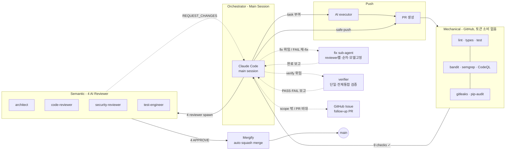
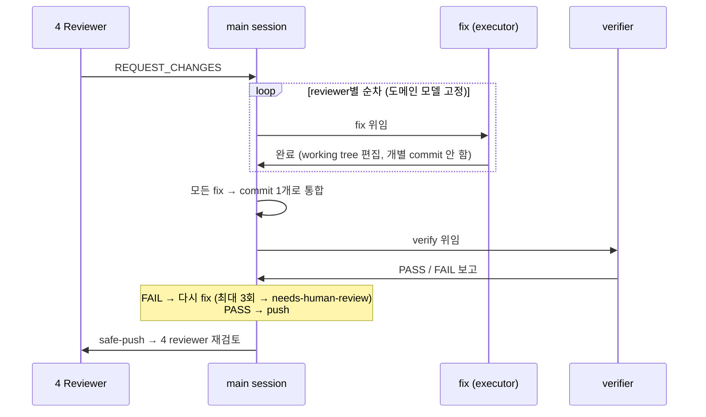

# 개발 프로세스: AI DLC v2

> **이 문서의 정체성**: AI DLC 의 전체 흐름과 분업 구조를 정의하는 실행 매뉴얼. 코드 레벨 상세는 각 파일 링크 참조.

## 1. 핵심 원칙 — Mechanical / Semantic 분업

| layer | 담당 | 토큰 | 상세 |
|---|---|---|---|
| **Mechanical** | GitHub (Actions + Security) | 소비 없음 | lint, type, test, SAST, secrets, deps, Dependabot, Push Protection |
| **Semantic** | 4 AI reviewer | 사용 | 설계, 로직 결함, 비즈니스 보안, edge case — **GitHub 이 이미 하는 영역 검토 금지** |

→ lint/CVE/secret 등 mechanical 검증은 GitHub 에 위임하여 AI 토큰 소비를 제거한다.

> **용어 정리**
>
> | 용어 | 의미 |
> |---|---|
> | **lint** | 코드 스타일 · 문법 오류 자동 검사 (ruff, eslint) |
> | **type** | 정적 타입 검사 (mypy, tsc) |
> | **test** | 자동화 테스트 실행 (pytest) |
> | **SAST** | Static Application Security Testing — 소스 코드 정적 보안 분석 (bandit, semgrep, CodeQL) |
> | **secrets** | 소스 코드 내 API key · password · token 유출 탐지 (gitleaks) |
> | **deps** | dependency 의 알려진 취약점(CVE) 검사 (pip-audit) |
> | **CVE** | Common Vulnerabilities and Exposures — 공개된 보안 취약점 식별 번호 |
> | **Dependabot** | GitHub 내장 — dependency CVE 자동 감지 + fix PR 생성 + 정기 버전 업데이트 |
> | **Push Protection** | GitHub 내장 — push 시점에 secret 유출을 차단 (commit 자체 거부) |

## 2. 전체 플로차트



> 다이어그램 원본: [`docs/showcase/03-ai-dlc-flowchart.mmd`](../showcase/03-ai-dlc-flowchart.mmd)

## 3. Mechanical layer — GitHub (토큰 소비 없음)

### 3.1 GitHub Actions (9 checks)

| workflow | job | 검사 대상 |
|---|---|---|
| `lint.yml` | lint | ruff |
| `types.yml` | types | mypy |
| `test.yml` | test | pytest |
| `sast.yml` | bandit | bandit |
| `sast.yml` | semgrep | semgrep |
| `sast.yml` | codeql | CodeQL (workflow job) |
| GHAS | CodeQL | CodeQL (GitHub Advanced Security) |
| `secrets.yml` | gitleaks | gitleaks |
| `deps.yml` | pip-audit | pip-audit |

→ [`.github/workflows/`](../../.github/workflows/)

### 3.2 GitHub Security (Settings UI)

| 기능 | 역할 |
|---|---|
| **Push Protection** | push 시점 secret 차단 |
| **Dependabot Alerts** | dependency CVE 자동 감지 |
| **Dependabot Security Updates** | CVE fix PR 자동 생성 |
| **Dependabot Version Updates** | 정기 dependency bump PR |
| **Code Scanning (CodeQL)** | PR inline comment + check |

### 3.3 Branch Protection (main)

- Required approving reviews: **4**
- Dismiss stale reviews: **true**
- Force push: **deny**
- Mergify app: bypass allowed (auto-merge 용)

## 4. Semantic layer — 4 AI Reviewer

### 4.1 Reviewer scope

| agent | scope | GitHub 영역 제외 |
|---|---|---|
| **architect** | 설계 · 의존성 · 추상화 | — |
| **code-reviewer** | 로직 결함 · SOLID · design smell | syntax/style/lint/type/dead code |
| **security-reviewer** | 비즈니스 보안 · TOCTOU · auth/authz | CVE/secret/dependency/SAST |
| **test-engineer** | edge case · 새 test 권고 · 전략 | test 실행/coverage %/mechanical |

### 4.2 Verdict 정책

| role | blocking severity | informational |
|---|---|---|
| code-reviewer | CRITICAL/HIGH at HIGH confidence | MED/WARN/LOW/INFO |
| architect | CRITICAL+HIGH+MED+WARN | LOW/INFO |
| security-reviewer | CRITICAL+HIGH | MED/WARN/LOW/INFO |
| test-engineer | CRITICAL+HIGH | MED/WARN/LOW/INFO |

→ [`post-review/SKILL.md`](../../.claude/skills/post-review/SKILL.md)

### 4.3 Review scope

매 cycle **전체 PR diff** (`origin/main...HEAD`). incremental scope 금지 — 기존 finding 사각지대 방지.

## 5. Fix cycle — REQUEST_CHANGES 처리

1+ reviewer 가 `REQUEST_CHANGES` 시 orchestrator (main session) 의 의무.

전체 순서 (위→아래 = 시간 순서. main 이 모든 단계를 중계 — sub-agent 간 직접 hand-off 없음):



> 위 다이어그램은 §2 아키텍처 플로차트(전체 시스템 개요)와 **역할 분리**: 플로차트 = 무엇이 어디에, 본 시퀀스 = fix cycle 의 시간 순서.

### 5.1 Scope 판정

| 상황 | 처리 |
|---|---|
| **본 PR scope 안** + PR 크기 적정 | reviewer별 fix → 단일 verify → 본 PR 에서 commit (§5.2) |
| **본 PR scope 밖** 또는 **PR 비대** | GitHub Issue 등록 → 별도 follow-up PR |

### 5.2 Fix → Verify → Push (scope 안)

**fix** — REQUEST_CHANGES 낸 **reviewer 별 전용 fix sub-agent** (agent type `executor`) 를 **단일 worktree 에서 순차** 호출. 모델은 reviewer 도메인별 정적 고정 (런타임 escalate 판단 없음):

| REQUEST_CHANGES reviewer | fix 모델 |
|---|---|
| architect · security-reviewer | opus |
| code-reviewer · test-engineer | sonnet |

각 fix sub-agent 는 `fix-review` skill 의 `brief-template.md` 의무 항목 포함:

- review comment 직접 read (`gh pr view --json reviews`)
- 옛 fix evidence 읽기 (`.omc/state/fix-evidence/pr-<N>.json`) — 역추론 금지
- regression verify (evidence 의 fix_lines grep)
- finding 의 location + code field 읽기
- fix evidence 쓰기 (다음 cycle 사각지대 방지)

각 fix sub-agent 는 **working tree 만 편집하고 개별 commit 하지 않는다** — 순차 fix 가 모두 끝난 뒤 **main 이 1 회 commit 으로 통합** (그 결과의 lint/type/format fix 포함). last review SHA 이후 HEAD 까지 commit 정확 1 개 (분리됐으면 `git commit --amend` 또는 `git reset --soft <last-review-sha> && git commit -F file` 로 squash). verify `PASS` 후 main 이 `bash run.sh <BRANCH> --force-with-lease` 로 re-push.

**verify** — fix 수렴 후 **단일 verifier sub-agent** (agent type `verifier`, sonnet) 가 **변경 전체를 한 agent 가 한 번에** 검증 (= 전체 통합 검증). reviewer 별로 안 쪼갬 — 한 도메인의 fix 가 다른 도메인의 fix 를 깨뜨리는 regression 은 전체를 봐야 잡히기 때문. 결과를 `PASS`/`FAIL` 로 **main 에 보고만** 함 (push 금지).

**push** — verify 결과별 main 의 행동:

- `FAIL` → main 이 재-fix 지시 (fix→verify 재실행, **최대 3회** — 3회 연속 FAIL 시 `needs-human-review` + 사용자 개입. §5.4)
- `PASS` → main 이 `safe-push` → 4 reviewer cycle 재진입

→ [`fix-review/SKILL.md`](../../.claude/skills/fix-review/SKILL.md) · [`verify-fix/SKILL.md`](../../.claude/skills/verify-fix/SKILL.md)

### 5.3 Follow-up Issue (scope 밖)

scope 밖 finding 또는 PR 이 너무 커지는 경우 — **무시 금지**, GitHub Issue 로 분리:

```bash
gh issue create --label follow-up,<severity> --title "..." --body "출처: PR #N, finding: ..."
```

본 PR description 의 `## Follow-up` 섹션에 issue link 명시. 본 PR 머지 후 별도 PR 로 처리.

> **핵심 원칙**: 어떤 WARN/MED finding 도 "무시" 로 끝나지 않는다. 본 PR 처리하거나 Issue 로 분리.

### 5.4 Retry 한도

**두 루프 모두 최대 3회** — 초과 시 본 PR 에 `needs-human-review` label 부착 + 사용자 개입 (orchestrator 자율 진행 중단):

| 루프 | 한도 초과 조건 |
|---|---|
| **reviewer cycle** (outer) | 같은 finding 으로 reviewer 가 **3 cycle** 연속 REQUEST_CHANGES |
| **fix→verify** (inner) | verifier 가 **3회** 연속 FAIL (non-converging fix — 무한 루프 방지) |

## 6. Auto-merge — Mergify

| rule | 조건 | action |
|---|---|---|
| dismiss approvals | 새 commit push | approve dismiss |
| auto-merge | 4 bot approve + 9 CI pass | squash merge |
| Dependabot auto-merge | author=dependabot[bot] + 9 CI pass | auto-approve + squash merge |

→ [`.mergify.yml`](../../.mergify.yml)

## 7. Client-side safety net

| layer | 역할 | 파일 |
|---|---|---|
| `settings.json` deny | raw `gh pr merge`/`review`/`comment`, `git push` 차단 | [`.claude/settings.json`](../../.claude/settings.json) |
| `pre-bash-gate.sh` | Bash hook — alias/env/chain 우회 차단 + agent identity 검증 | [`.claude/hooks/pre-bash-gate.sh`](../../.claude/hooks/pre-bash-gate.sh) |
| `post.sh` | review 게시 entry — identity/scope/verdict verify | [`.claude/skills/post-review/post.sh`](../../.claude/skills/post-review/post.sh) |
| `safe-push/run.sh` | push entry — branch 검증 + CI wait | [`.claude/skills/safe-push/run.sh`](../../.claude/skills/safe-push/run.sh) |

## 8. Bot accounts

4 GitHub free accounts, 각각 별도 fine-grained PAT:

| account | PAT 권한 |
|---|---|
| `simsim-architect-bot` | Pull requests RW + Metadata R |
| `simsim-code-reviewer-bot` | Pull requests RW + Metadata R |
| `simsim-security-reviewer-bot` | Pull requests RW + Metadata R |
| `simsim-test-engineer-bot` | Pull requests RW + Metadata R |

PAT storage: `~/.config/macro-logbot/<role>-bot.env` (chmod 600)

→ [`post-review/SKILL.md §env`](../../.claude/skills/post-review/SKILL.md#env-의-위치)
