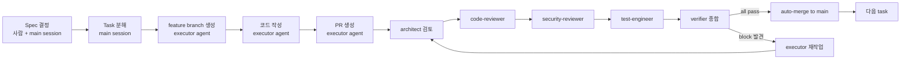
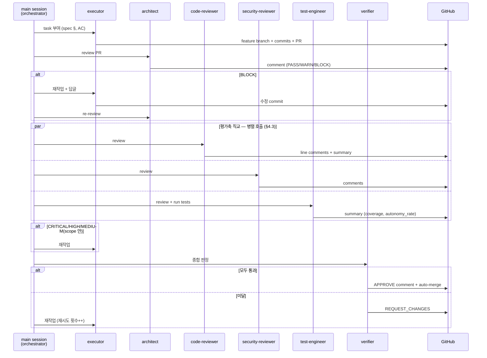

# 개발 프로세스: AI-Driven SDLC

> **이 문서의 정체성**: 본 문서는 단순 설명서가 아니라 **다른 Claude Code(또는 동급 AI 에이전트)가 이 repo를 받아서 즉시 동일한 SDLC를 재현할 수 있는 실행 매뉴얼**입니다. 각 서브에이전트의 역할·호출 트리거·검토 기준·출력 형식·통과 조건이 정량적으로 정의됩니다.

## 1. 메타 정의 (Two Layers)

본 프로젝트엔 두 개의 층이 동시에 진행됩니다:

| 층 | 내용 | 관할 |
|---|---|---|
| **제품 층 (Product)** | macro-logbot 시스템 자체를 SDLC로 구축 | Stage 1 요구사항 → Stage 2 설계 → Stage 3 구현 |
| **메타 층 (Meta)** | 그 SDLC를 AI 서브에이전트 자동화로 운영 (AI-driven SDLC) | 본 문서가 정의 |

→ macro-logbot 자체가 AI 시스템이고, 그것을 만드는 프로세스도 AI 자동화이므로 본 repo는 **"AI가 AI를 만드는 절차"의 실증 사례**가 된다.

## 2. AI-Driven SDLC 전체 흐름



## 3. 서브에이전트 매트릭스

각 에이전트는 **호출 트리거 + 검토 대상 + 검토 기준 + 출력 형식 + 통과 조건** 5요소가 명시되어야 자동화 가능합니다.

### 3.1 `executor` agent — 코드 작성·수정

| 항목 | 내용 |
|---|---|
| **역할** | spec의 task definition을 받아 코드 작성, reviewer comment 받으면 수정 |
| **모델** | Sonnet 기본 (단순 작업), Opus (복잡한 설계 작업) |
| **호출 트리거** | (1) 새 task 시작 시 (2) reviewer가 BLOCK/CRITICAL/HIGH comment 남겼을 때 |
| **검토 대상** | spec §의 해당 task + 받은 리뷰 코멘트 + 기존 코드베이스 |
| **출력** | (1) feature branch commits (2) PR description (3) 리뷰 답글 |
| **PR description 템플릿** | 아래 §6.1 참조 |
| **재시도 한도** | 같은 PR에서 BLOCK 발생 시 최대 3회 수정. 4회째 BLOCK이면 사람 호출 |

**호출 명령 예시**:
```
Agent(subagent_type="oh-my-claudecode:executor", 
      model="sonnet",
      description="MCP grep_codebase tool 구현",
      prompt="Stage 2 spec §5.3 Tool #1 (grep_codebase)을 src/tools/grep.py에 구현. acceptance criteria: ...")
```

### 3.2 `architect` agent — 아키텍처 적합성

| 항목 | 내용 |
|---|---|
| **역할** | PR이 spec의 컴포넌트 책임 분리·NFR·메타 정의를 위반하지 않는지 검토 |
| **모델** | Opus (구조적 판단 필요) |
| **호출 트리거** | PR 생성 직후 (가장 먼저) |
| **검토 대상** | 컴포넌트 인터페이스 변경, 새 의존성 추가, 디자인 패턴 사용, NFR(특히 NFR-3·4·6) 영향 |
| **검토 기준** | ✅ PASS: spec과 일관, 컴포넌트 책임 명확, 의존성 합리적<br>⚠️ WARN: spec과 다르지만 합리적 이유 있음, 또는 spec 갱신 필요<br>❌ BLOCK: 컴포넌트 책임 위반, 순환 의존성, NFR 회귀, 메타 정의 위반 |
| **출력** | PR 일반 comment 1개 (§6.2 형식) |
| **통과 조건** | BLOCK 0개. **WARN 발견 시 무시 금지** — 본 PR scope 안이면 수정 commit, scope 밖이면 [`docs/process/FOLLOWUP-TASKS.md`](FOLLOWUP-TASKS.md) queue 등록 + 본 PR description의 "Follow-up" 섹션에 task ID 명시 (자동 follow-up PR 처리) |

### 3.3 `code-reviewer` agent — 코드 품질

| 항목 | 내용 |
|---|---|
| **역할** | 정확성·가독성·유지보수성·작은 버그 검토 |
| **모델** | Sonnet 기본, Opus (복잡한 logic) |
| **호출 트리거** | architect 통과 후 |
| **검토 대상** | PR로 변경된 모든 파일 라인별 |
| **검토 기준 (severity)** | **CRITICAL**: 정확성 버그, 데이터 손실, 보안 결함<br>**HIGH**: 회귀 위험, 명백한 성능 문제, 잘못된 logic<br>**MEDIUM**: 가독성·작은 버그·edge case 누락<br>**LOW**: 스타일·네이밍·minor refactor<br>**INFO**: 제안 (선택) |
| **출력** | (1) 각 발견사항: **line-level comment** (CRITICAL/HIGH는 필수, MEDIUM 이하는 선택) (2) summary general comment 1개 |
| **통과 조건** | CRITICAL 0개, HIGH 0개, **MEDIUM 0개**. MEDIUM 발견 시 무시 금지 — 본 PR scope 안이면 수정 commit, scope 밖이면 [`FOLLOWUP-TASKS.md`](FOLLOWUP-TASKS.md) queue 등록. LOW/INFO는 정보성 (차단 없음) |

### 3.4 `security-reviewer` agent — 보안

| 항목 | 내용 |
|---|---|
| **역할** | OWASP Top 10 + macro-logbot 특화 보안 (시크릿 노출, 사내 코드/로그 유출, 외부 통신) |
| **모델** | Opus (보안 판단 보수적) |
| **호출 트리거** | code-reviewer 통과 후 |
| **검토 대상** | 변경 코드, 새 의존성(CVE 검색), 시크릿 패턴, 네트워크 호출 |
| **검토 기준** | **CRITICAL**: 시크릿 hardcoded, RCE 가능성, 인증 우회, 사내 데이터 외부 통신<br>**HIGH**: SQL/Command/Path injection, XSS, 인가 결함<br>**MEDIUM**: 의존성 CVE, 시큐어 코딩 미준수<br>**LOW**: 보안 권장사항 |
| **macro-logbot 특화** | (1) Tool System에 write/exec 도구 없는지 (2) 분석 대상 코드/로그가 외부로 누출되는 경로 없는지 (NFR-2, AC-3) (3) `.env`·시크릿 commit 안 됐는지 |
| **출력** | line-level comment + summary |
| **통과 조건** | CRITICAL 0개, HIGH 0개, **MEDIUM 0개** (위 §3.3과 동일 정책 — 본 PR scope 안 수정 또는 [`FOLLOWUP-TASKS.md`](FOLLOWUP-TASKS.md) 등록). LOW는 정보성 |

### 3.5 `test-engineer` agent — 테스트·평가

| 항목 | 내용 |
|---|---|
| **역할** | 단위 테스트 적정성 + 기존 테스트 회귀 + PoC PR이면 평가 매트릭스 실행 |
| **모델** | Sonnet 기본 |
| **호출 트리거** | security 통과 후 |
| **검토 대상** | 새 코드의 테스트 커버리지, 기존 테스트 영향, PoC 영향 |
| **검토 기준** | (1) 단위 테스트: 새 코드 line coverage ≥ **80%**<br>(2) 모든 기존 테스트 통과 (`pytest` exit 0)<br>(3) PoC PR(`poc/` 변경): 평가 매트릭스 실행 후 **현 단계 baseline 충족** (PoC baseline 30%, 개선 사이클 60%) |
| **실행 명령** | `pytest tests/ -v --cov=src --cov-fail-under=80` 그리고 PoC PR이면 `python scripts/poc/evaluate.py --quick` |
| **출력** | summary comment에 테스트 결과 표 + 커버리지 수치 + (해당 시) PoC autonomy_rate |
| **통과 조건** | 위 3개 항목 모두 충족 |

### 3.6 `verifier` agent — 최종 게이트 + 자동 머지

| 항목 | 내용 |
|---|---|
| **역할** | 모든 prior reviewer 결과 종합 + Acceptance Criteria 일치 확인 + auto-merge 결정 |
| **모델** | Opus (최종 결정) |
| **호출 트리거** | test-engineer 통과 후 |
| **검토 대상** | 4개 reviewer comment 누적, PR description, spec의 Acceptance Criteria |
| **검토 기준** | (1) architect: BLOCK 0, WARN 처리 완료 (수정 또는 FOLLOWUP-TASKS.md 등록)<br>(2) code-reviewer: CRITICAL/HIGH/**MEDIUM** 0 (또는 follow-up PR로 분리)<br>(3) security-reviewer: CRITICAL/HIGH/**MEDIUM** 0 (또는 follow-up PR로 분리)<br>(4) test-engineer: 3개 조건 충족<br>(5) PR이 명시한 AC가 모두 코드에 반영<br>(6) spec(요구사항·설계)과 일관<br>(7) **모든 WARN/MEDIUM이 본 PR 수정 또는 [`FOLLOWUP-TASKS.md`](FOLLOWUP-TASKS.md) 등록 둘 중 하나로 처리됨** (무시 금지) |
| **결정** | ✅ **APPROVE**: 위 항목 모두 충족 → `gh pr merge --squash --auto`<br>❌ **REQUEST_CHANGES**: 미달 항목 명시 → executor에게 수정 호출<br>⏸ **NEEDS_HUMAN**: 3회 재시도 후에도 미달 → label `needs-human-review` 부착, 사람 호출 |
| **출력** | summary comment + (APPROVE 시) merge commit message 작성 |
| **자동 머지 명령** | `gh pr merge <PR#> --squash --auto --delete-branch` |

### 3.7 (선택) `critic` agent — 다관점 검토

| 항목 | 내용 |
|---|---|
| **역할** | 큰 디자인 변경·논쟁 가능한 결정에 대해 multi-perspective 검토 |
| **호출 트리거** | architect 후, PR description에 `needs-critic: true` 또는 변경 LOC > 500 시 |
| **출력** | "장점 / 단점 / 대안" 형식 comment |
| **통과 조건** | 없음 (자문 목적, 차단 권한 없음) |

## 4. PR 워크플로우 (단계별)

### 4.1 Sequence Diagram



### 4.2 재시도 정책

- 같은 PR 내에서 reviewer가 BLOCK/CRITICAL/HIGH/**WARN/MEDIUM(본 PR scope 안일 때)** 제기 → executor 재작업 (scope 밖 WARN/MEDIUM은 §6.8 follow-up PR 경로)
- **재시도 한도**: 3회
- 4회째 미통과 시:
  - `needs-human-review` 라벨 부착
  - PR 상단 comment로 사람 호출
  - 자동 머지 중단

### 4.3 Reviewer 병렬 호출 정책

평가축이 **직교(orthogonal)** 인 reviewer 들은 동일 commit 에 대해 **동시 호출** 가능 — 효율 위해 권장.

#### 호출 모드 분류

| 단계 | 호출 모드 | 이유 |
|---|---|---|
| 1. `architect` | **단일** | scope/architecture 평가 결과가 후속 reviewer 가 봐야 할 commit 범위에 영향 — WARN scope 안 → fix commit 후 후속 reviewer 가 그 결과 위에서 평가해야 의미 |
| 2. (필요 시) `executor` fix commit | — | architect WARN scope 안 처리 + scope 밖은 FOLLOWUP-TASKS.md 등록 |
| 3. `code-reviewer` + `security-reviewer` + `test-engineer` | **병렬** | 평가축 직교 (품질·보안·테스트), 보는 commit 동일 |
| 4. `verifier` | **단일** | 위 3개 결과 통합 + 최종 머지 직전 검증 |

#### 시간 순서 (§6.5) 와의 양립

병렬 호출이라도 **PR 코멘트 게시 시각** 은 §6.5 시간 순서 정책 그대로 — 동일 commit 에 대한 동시 평가이므로 시간 순서가 깨지지 않는다 (오히려 자연스럽다: 평가 결과가 비슷한 시각에 모이는 게 정직).

#### 단일 호출 강제 케이스

다음 상황은 병렬 금지 — 직렬 호출 필수:

1. **선행 reviewer 가 본 PR scope 안 fix 를 요구한 경우** — 후속 reviewer 가 fix commit 결과 위에서 평가해야 의미. 예: architect WARN scope 안 → fix → code-reviewer 호출.
2. **fix commit 이후 재시도 (§4.2)** — 같은 단계 reviewer 를 다시 부르는 경우. 시간 순서 보존 위해 직렬.

#### 적용 시점

PR #8 (feat/llm-gateway) 부터 적용. 본 정책 이전 PR (#1~#7) 은 모두 직렬로 진행됨 — soft migration, 기존 PR 재진행 불필요.

## 5. 자동 머지 정량 기준 (집약)

```yaml
auto_merge_conditions:
  architect:
    block: 0
    warn_handled: true        # 본 PR 수정 OR FOLLOWUP-TASKS.md 등록 (무시 금지)
  code_reviewer:
    critical: 0
    high: 0
    medium: 0                 # MEDIUM 발견 시 본 PR scope 안 수정 또는 follow-up PR 분리
  security_reviewer:
    critical: 0
    high: 0
    medium: 0
  test_engineer:
    unit_tests_pass: true
    new_code_coverage_min: 0.80
    poc_baseline_pass: true   # poc/ 변경 PR만 적용
  verifier:
    acceptance_criteria_satisfied: true
    spec_consistency: true
    all_warns_addressed: true # WARN/MEDIUM 모두 처리 완료 (수정 OR follow-up PR 등록)
  retries:
    max: 3
    on_exhausted: "label_needs_human_review"
```

`verifier` agent는 이 YAML과 동일한 schema로 PR 상태를 평가합니다.

## 6. 흔적 가이드라인 (Showing AI-Driven SDLC)

### 6.1 PR description 템플릿 (executor가 작성)

```markdown
## 🎯 Task
- Spec reference: docs/design/02-설계문서.md §<n>
- Acceptance Criteria: AC-<m>, AC-<k>

## 📝 Changes
- <bullet 1>
- <bullet 2>

## ✅ Self-checks
- [ ] Spec과 일치
- [ ] 단위 테스트 추가
- [ ] AC 충족

## 🤖 Agent metadata
- Generated by: executor agent (Sonnet)
- Spec context: docs/design/02-설계문서.md (v1.0)
- Session: .omc/sessions/<id>
```

### 6.2 Reviewer comment 템플릿

**General comment (architect / verifier 등)**:

```markdown
🤖 **[<agent-name>]**
대상 commit: <full-hash — 백틱 없이, GitHub 자동 link 보존; §6.6 참조>

> [!CAUTION] (또는 [!WARNING] / [!TIP] / [!NOTE]; §6.7 callout 매핑 참조)
> **Severity: <BLOCK | WARN | PASS | COMMENT>** — 한 줄 요약

### Findings
- <finding 1>
- <finding 2>

### Recommendation
<APPROVE | REQUEST_CHANGES | COMMENT>

---
_Auto-generated by macro-logbot AI-driven SDLC pilot. Session: .omc/sessions/<id>_
```

**Line-level comment (code-reviewer / security-reviewer)**:

```markdown
🤖 **[<agent-name>]**
대상 commit: <full-hash — 백틱 없이, §6.6>

> [!CAUTION] (또는 [!WARNING] / [!NOTE]; §6.7 callout)
> **Severity: <CRITICAL | HIGH | MEDIUM | LOW>** — file:line + 한 줄 요약

<설명 — 무엇이 문제인지, 왜 문제인지>

**Suggested fix:**
```python
<코드>
```

_Rule reference: <if applicable>_
```

### 6.3 Commit message 트레일러

모든 commit message 끝에:

```
Co-Authored-By: <agent-name> <noreply@anthropic.com>
```

리뷰 반영 commit이면 추가로:

```
Address <agent-name> review on PR #<N> (line <K> of <file>)
```

### 6.4 Merge commit (verifier가 작성)

```
Merge PR #<N>: <title>

All review agents approved:
✅ architect (PASS)
✅ code-reviewer (no CRITICAL/HIGH)
✅ security-reviewer (no CRITICAL/HIGH)
✅ test-engineer (coverage 87%, all tests pass)

AC satisfied: AC-<m>, AC-<k>

Auto-merged by verifier agent.
```

### 6.5 시간 순서 정직성 (PoC 단계 — Stage A 자동화, §10 참조)

Reviewer comment는 **코드 변경 commit보다 시간순으로 먼저 post**되어야 한다. PR 페이지 timeline에 "review → 수정 commit" 인과 흐름이 자연스럽게 보이도록 정직성 유지.

올바른 순서:
1. PR 생성 → executor commit push (T0)
2. **architect comment post (T1)**
3. BLOCK/WARN 반영 수정 commit push (T2 > T1)
4. (필요 시) architect 재호출 + comment 답글
5. **code-reviewer comment post (T3)**
6. ...

main session orchestrator가 한 Bash chain에 "commit + push + comment"를 묶으면 timestamp 역전 가능. **반드시 분리**:
- 먼저 `gh pr comment` post (별도 명령)
- 그 다음 executor agent로 수정 commit (별도 명령)

수정 commit message에는 review 참조 명시:
```
Address <agent-name> review on PR #<N> (review of <commit-hash>)
```

### 6.6 Commit hash 표기 규칙 — 백틱 없이

GitHub은 7자 이상 commit hash를 자동으로 commit link로 변환. 백틱(` `)으로 감싸면 inline code로 처리되어 자동 link 안 됨.

| 표기 | 결과 |
|---|---|
| 대상 commit: a2ac07b (백틱 없음) | ✅ GitHub 자동 link |
| 대상 commit: a2ac07be9a4d... (full hash) | ✅ 자동 link |
| 대상 commit: \`a2ac07b\` (백틱 감쌈) | ❌ inline code, link 안 됨 |

→ 모든 reviewer comment는 commit hash를 **백틱 없이** 표기.

### 6.7 Severity 시각화 — GitHub callout

GitHub markdown alert syntax 활용. reviewer comment 첫 부분에 severity 명확 표시:

| Severity | Callout | 의미 |
|---|---|---|
| BLOCK / CRITICAL / HIGH | `> [!CAUTION]` | 머지 차단 |
| WARN / MEDIUM | `> [!WARNING]` | 권장 수정 (BLOCK 아님, §6.8 처리 의무) |
| PASS | `> [!TIP]` | 머지 기준 충족 |
| LOW | `> [!NOTE]` | 정보성 — 스타일·네이밍·minor refactor. 차단 없음, §6.8 follow-up 등록 불필요 |
| COMMENT / INFO | `> [!NOTE]` | 정보성 — 제안·관찰. 차단 없음, §6.8 follow-up 등록 불필요 |

예시:

```markdown
> [!CAUTION]
> **Severity: BLOCK** — 한 줄 요약 사유

> [!WARNING]
> **Severity: WARN** — 권장 사항

> [!TIP]
> **Severity: PASS** — 머지 기준 충족
```

### 6.8 WARN/MEDIUM 무시 금지 + Follow-up PR 의무

reviewer agent가 발견한 **WARN** (architect) / **MEDIUM** (code-reviewer · security-reviewer) finding은 무시 금지. 두 가지 경로:

1. **본 PR scope 안**: executor agent가 본 PR에서 수정 commit (§4 재시도 정책 적용)
2. **본 PR scope 밖**: [`FOLLOWUP-TASKS.md`](FOLLOWUP-TASKS.md) queue에 task 등록 + 본 PR description의 "Follow-up" 섹션에 task ID 명시

본 PR 머지 직후 main session orchestrator (또는 자동화)가 `FOLLOWUP-TASKS.md` queue를 점검:
- 각 pending task에 대해 별도 작은 PR 생성
- 그 PR도 정상 reviewer cycle 거쳐 머지
- 완료된 task는 `FOLLOWUP-TASKS.md`의 "Completed" 섹션으로 이동

**LOW / INFO** finding은 정보성만 — queue 등록 불필요, 차단 없음.

**원칙**: 어떤 WARN/MEDIUM도 "무시"로 끝나지 않는다. 본 PR 처리하거나 follow-up PR로 정리.

## 7. 실패 처리

| 상황 | 처리 |
|---|---|
| executor 3회 재시도 후 미통과 | `needs-human-review` label + PR 상단 사람 호출 comment |
| 어느 reviewer agent 호출 실패 (API 에러 등) | 1회 재시도, 그래도 실패 시 `agent-failure` label + 사람 호출 |
| spec 자체가 모호해서 판단 불가 | `needs-spec-clarification` label, Stage 1·2 spec 보강 요청 |
| 머지 후 main이 깨짐 (회귀) | `git revert <merge-commit>` 자동 실행 + `regression-rollback` label + 사람 통보 |

## 8. 다른 Claude Code가 본 SDLC를 재현하는 법

다른 Claude Code 인스턴스(또는 동급 AI)가 이 repo를 받아 같은 SDLC를 따르려면:

### 8.1 필수 컨텍스트
1. 본 문서 (`docs/process/03-개발-프로세스.md`)
2. Stage 1·2 spec (`docs/requirements/`, `docs/design/`)
3. `CONTRIBUTING.md`

### 8.2 사용 도구
- `gh` CLI (PR 생성·comment·머지)
- `Agent` 도구 (서브에이전트 호출, `subagent_type` 지정)
- `Bash`/`Read`/`Write`/`Edit` (코드 작성)

### 8.3 재현 절차

```python
# 의사 코드 — main session에서 실행되는 orchestration loop

def handle_task(task_spec):
    # 1. executor가 작업
    Agent(subagent_type="oh-my-claudecode:executor",
          prompt=task_spec + " feature branch는 feat/<short-name>")
    
    pr_number = gh_pr_create(...)
    
    # 2. 순차 reviewer 호출
    for reviewer in ["architect", "code-reviewer", "security-reviewer", "test-engineer"]:
        retries = 0
        while retries < 3:
            review = Agent(subagent_type=f"oh-my-claudecode:{reviewer}",
                          prompt=f"Review PR #{pr_number} per §3.{i} of process doc")
            gh_pr_comment(pr_number, format_comment(reviewer, review))
            
            if review.has_blocker():
                Agent(subagent_type="executor",
                      prompt=f"Address {reviewer} comments on PR #{pr_number}")
                retries += 1
            else:
                break
        
        if retries >= 3:
            gh_pr_label(pr_number, "needs-human-review")
            return
    
    # 3. verifier 종합
    verdict = Agent(subagent_type="oh-my-claudecode:verifier",
                    prompt=f"Apply §5 auto_merge_conditions to PR #{pr_number}")
    
    if verdict == "APPROVE":
        gh_pr_merge(pr_number, "--squash --auto --delete-branch")
```

### 8.4 검증 방법

본 문서의 자동화가 잘 작동하는지 확인하려면, 본 repo의 **closed PR list**를 보고 다음이 모두 만족하는지 점검:
- 각 PR에 5개(architect, code-reviewer, security-reviewer, test-engineer, verifier) reviewer comment가 있음
- 모든 comment가 `🤖 [<agent-name>]` 표식
- merge commit message에 "All review agents approved" 명시
- BLOCK/CRITICAL/HIGH 발생 PR은 재작업 commit이 있음

## 9. 본 문서의 갱신

다음 영역의 변경은 **메타 변경**으로 분류 (reviewer scope: architect + verifier만 호출):

- `docs/process/` · `docs/design/` · `docs/requirements/` · `CONTRIBUTING.md` · `README.md` — 정책·spec 자체
- `.github/workflows/` · `.github/` 기타 — CI·자동화 인프라
- `pyproject.toml`의 빌드·linter·formatter 설정 (런타임 코드와 무관한 도구 설정)

브랜치 패턴: `docs/<name>` · `ci/<name>` · `chore/<name>` 중 변경 성격에 맞춰 선택. PR 처리 절차:

- architect agent + verifier agent만 호출 (다른 reviewer는 skip)
- 본 문서(`docs/process/03-...`) 자체 변경에는 사람 1회 final review 권장 (자기 정의 문서이므로)

## 10. 자동화 진화 단계 (Automation Evolution)

본 프로젝트 자동화의 **현재 단계와 향후 path**를 명시. 다른 Claude Code(또는 동급 AI)가 재현 시 어느 단계인지 확인 후 따라야 함.

### 10.1 현재 단계 (Stage A) — main session orchestrator + 봇 PAT

| 역할 | 담당 |
|---|---|
| Orchestrator | 사용자가 활성화한 Claude Code 세션 (`claude` CLI 또는 IDE 통합) — **simsimhugh** 계정 PAT |
| Reviewer commenter | GitHub bot account **simsimhugh-bot** + PAT (scope: `repo` + `workflow`) |
| PR 작성·머지 명령 | simsimhugh PAT (orchestrator author) |
| Reviewer comment | 봇 PAT로 `gh pr comment` (봇 아바타로 표시) |
| 자동 머지 | verifier APPROVE 시 봇 PAT로 `gh pr merge <N> --squash --auto` |

**장점**:
- **진짜 OMC 서브에이전트 분리 호출** — §3 매트릭스 정직 충족 (§8.4 재현 검증 그대로 통과)
- 봇 아바타로 reviewer comment 표시 — 외부 보여주기 가치 명확
- 셋업 비용 거의 0 (봇 계정 + PAT만)

**제약**:
- 사용자 세션 활성 동안만 작동 — 24/7 자동화 ❌
- main session orchestrator 호출 필요 ("PR #N review해 줘" 같은 trigger)

### 10.2 미채택 단계 (Stage B) — GitHub Actions

**PR #4 (closed)** 시도 결과:

- `claude-code-action@beta`는 OMC 플러그인 인식 못 함 → 진짜 분리 reviewer 불가 (단일 Claude가 simulation)
- `mode: tag` 기본값 + `@claude` mention 없으면 trigger gating으로 실행 안 됨
- Actions runner의 비표준 OMC 설치는 1~2일 셋업 부담

**채택 보류 결정**. 향후 다음 조건 충족 시 재검토:

- claude-code-action v1.0 stable + `mode: agent` 안정
- OMC 공식 Actions support 등장
- 사용자가 자체 OMC install workflow를 셋업 의향

PR #4 브랜치(`ci/pr-review-workflow`)는 폐기하지 않고 보존 — 미래 재시도 reference.

### 10.3 마이그레이션 path (Stage A → Stage B)

마이그레이션 비용 **거의 0**:

- 봇 계정·PAT → GitHub Secrets로 그대로 활용
- comment 규칙(§6.5~6.7) → 동일
- §3 reviewer 매트릭스 → 동일
- §5 자동 머지 정량 기준 → 동일

Stage B 채택 시 본 §10에 그 시점 명시 + 이전 PR 번호 reference.

### 10.4 현재 단계 검증 방법

본 repo의 closed PR list에서 다음 확인:

- Reviewer comment author = **simsimhugh-bot** (봇 아바타)
- merge 명령 author = simsimhugh (orchestrator)
- comment timestamp ≥ review 대상 commit timestamp (시간 순서 정직 — §6.5)
- 모든 comment에 대상 commit hash 명기 (백틱 없이 — §6.6)
- severity GitHub callout 시각화 적용 (§6.7)
- BLOCK/CRITICAL/HIGH 발생 PR은 재작업 commit이 comment 다음 시각으로 존재
