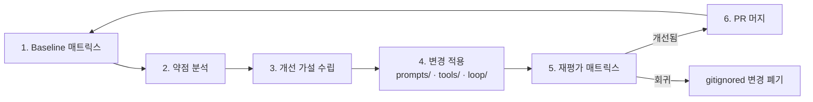

# PoC 운영 가이드

> **이 문서의 정체성**: 사외 환경에서 macro-logbot을 검증하기 위한 **재현 가능한 PoC 실행 매뉴얼**. Stage 2 spec §10(평가 설계)을 실제 실행 절차로 풀어 쓴 것. 다른 Claude Code가 본 가이드만 받아도 동일한 PoC를 돌릴 수 있어야 함.

## 1. 목적

| 항목 | 내용 |
|---|---|
| 검증 대상 | macro-logbot 시스템 — Agent Core + LLM Gateway + Tool System + Session |
| 측정 KPI | 자율 해결률 (full + partial) — Stage 2 spec §10.2 |
| 사내 대체 | Snake 게임 = MACRO 대체, 에러 카탈로그 = 사내 검증셋 대체, 무료 LLM = 사내 LLM 대체 |
| 사외 환경 신뢰도 | 시스템 무결성 검증의 약 80~90% (남는 변수: 사내 LLM의 reasoning 차이) |
| **핵심 미션** | **"가장 약한 LLM(예: Groq Llama 3)에서도 정확도를 끌어올리는 시스템 엔지니어링"** — macro-logbot의 가치는 LLM이 아니라 (Tool + 프롬프트 + agent loop + retrieval)에서 나옴 |

## 2. 폴더 구조

```
poc/
├── README.md                          # 운영 가이드 요약 (본 문서 link)
├── targets/                           # 테스트 대상 OSS
│   └── snake-game/
│       ├── original/                  # 원본 (MIT 클론, .gitkeep으로 자리만)
│       └── injected/                  # 에러 주입 변형 (스크립트 생성, .gitignore)
├── error_catalog/                     # 정답·주입 정의 (commit)
│   ├── E001-null-head.yaml
│   ├── E002-index-out-of-range.yaml
│   └── ...
├── reports/                           # 평가 결과 (.gitignore — 일부만 sample commit)
│   ├── 2026-MM-DD-<model>/
│   │   ├── case-<id>.json
│   │   └── summary.md
│   └── <date>-comparison.md
├── scripts/
│   ├── setup.sh                       # 1회: snake-game clone + venv
│   ├── inject.py                      # 카탈로그 → injected/ 생성
│   ├── trigger.py                     # injected 실행 + 에러 로그 캡처
│   └── evaluate.py                    # macro-logbot 매트릭스 호출 + 결과 저장
└── prompts/                           # 약한 LLM 강화용 system prompt iterations
    ├── v1-baseline.md
    ├── v2-cot-added.md
    └── ...
```

`.gitignore` 정책:
- `targets/snake-game/original/` — clone 결과, gitignore (재현 가능)
- `targets/snake-game/injected/` — 스크립트 생성, gitignore
- `reports/*/` — 큰 산출물, gitignore. 단 milestone 리포트는 별도 commit (`reports/milestone-*/`).

## 3. Snake 게임 setup

### 3.1 1회 setup

```bash
cd poc/
./scripts/setup.sh
```

`setup.sh` 내용:
```bash
#!/usr/bin/env bash
set -euo pipefail
cd "$(dirname "$0")/.."

# 1. Pygame Snake clone (MIT, ~200줄짜리 단순 클론)
SNAKE_REPO="https://github.com/<선정된-repo>/python-snake-game.git"  # 실제 선정 시 채움
mkdir -p targets/snake-game
git clone --depth 1 "$SNAKE_REPO" targets/snake-game/original

# 2. venv + pygame
python3 -m venv .venv
source .venv/bin/activate
pip install -r requirements.txt          # macro-logbot deps
pip install pygame                       # target deps

# 3. headless 실행 확인
SDL_VIDEODRIVER=dummy python targets/snake-game/original/snake.py --frames 30
echo "setup OK"
```

### 3.2 Headless 실행 원리

Pygame은 기본 GUI 필요지만 `SDL_VIDEODRIVER=dummy` 환경변수로 **headless 실행** 가능. CI·자동 평가 친화적.

## 4. 에러 카탈로그

### 4.1 카탈로그 schema

`poc/error_catalog/E<NNN>-<short-name>.yaml`:

```yaml
id: E001
short_name: null-head
category: runtime     # runtime | logic | type | env
severity: high        # 분석 난이도, not security severity

target_file: snake.py
target_function: update_position

# git apply 가능한 unified diff
injection_diff: |
  --- a/snake.py
  +++ b/snake.py
  @@ -40,7 +40,7 @@ class SnakeGame:
       def update_position(self):
  -        if self.head is not None:
  -            self.head.x += self.dx
  +        self.head.x += self.dx

# 에러 발생 트리거 명령
trigger:
  cmd: "SDL_VIDEODRIVER=dummy python snake.py --frames 30"
  expected_exit_code: 1
  timeout_seconds: 10

# 정답 (channel-by-channel 채점 가능하도록 구조화)
ground_truth:
  root_cause: "head 객체 미초기화 상태(None)에서 .x 속성에 접근하여 AttributeError 발생"
  root_cause_keywords:               # 키워드 기반 1차 매칭 (LLM-judge 보조)
    - "AttributeError"
    - "None"
    - "head"
    - "초기화" 또는 "init"
  location:
    file: snake.py
    function: update_position
    line: 42
  fix_hint: "init_game() 호출이 update_position() 보다 먼저 실행되도록 game loop 시작 부분에 guard 추가"
  expected_tool_calls:               # follow-up 채점 시 좋은 답이라면 호출했을 도구
    - grep_codebase    # head 초기화 위치 찾기
    - read_file        # init_game 함수 확인
```

### 4.2 Phase 1 카탈로그 10개

| ID | category | description |
|---|---|---|
| E001 | runtime | None object access → AttributeError |
| E002 | runtime | List index out of range |
| E003 | logic | Off-by-one in 충돌 감지 |
| E004 | type | TypeError (str + int) |
| E005 | runtime | KeyError (dict 잘못된 키) |
| E006 | logic | Reversed if condition |
| E007 | runtime | Division by zero |
| E008 | logic | Infinite loop (종료 조건 누락) |
| E009 | logic | Wrong variable assignment (score vs lives) |
| E010 | env | Encoding error (한글 처리) |

**카탈로그 갱신 정책**: 평가 사이클을 돌리며 macro-logbot이 너무 잘 풀거나(쉬움) 너무 못 푸는(난해) case가 보이면 카탈로그 PR로 보강.

## 5. 스크립트 사용법

### 5.1 inject.py — 에러 주입

```bash
# 단일 case
python scripts/inject.py --case E001

# 전체
python scripts/inject.py --all
```

동작:
1. `targets/snake-game/original/`을 `targets/snake-game/injected/<case-id>/`로 복사
2. 카탈로그의 `injection_diff`를 `git apply` (또는 patch)
3. 결과 디렉토리에 `case.yaml` 메타 사본 저장

### 5.2 trigger.py — 에러 발생·캡처

```bash
python scripts/trigger.py --case E001
```

동작:
1. `injected/<case-id>/` 디렉토리에서 카탈로그의 `trigger.cmd` 실행
2. exit code · stdout · stderr · stack trace 캡처
3. `injected/<case-id>/error_log.txt`에 저장
4. exit code 검증 (예상과 다르면 트리거 실패로 표시)

### 5.3 evaluate.py — 평가 매트릭스 자동 실행

```bash
# 모든 모델 × 모든 case
python scripts/evaluate.py --models all --cases all

# 특정 모델만 빠르게
python scripts/evaluate.py --models groq/llama-3.1-70b-versatile --cases E001 E002 E003

# Quick mode (test-engineer agent가 PR에서 호출)
python scripts/evaluate.py --quick   # cases 3개 × default model 1개만
```

동작 (한 case 기준):
1. `error_log.txt` + 카탈로그 메타를 macro-logbot 형식 페이로드로 변환
2. `MACRO_LOGBOT_DEFAULT_MODEL` 환경변수로 LLM swap
3. macro-logbot에 POST `/events` → session_id 받음
4. session_id 분석 완료까지 polling (timeout 5분)
5. `/sessions/<id>/report`로 1차 리포트 GET
6. Follow-up 자동 질문 N개 (§6.2) 진행
7. 결과 저장:
   ```
   poc/reports/<date>-<model>/case-<id>.json
   ```

JSON schema (`case-<id>.json`):
```json
{
  "case_id": "E001",
  "model": "groq/llama-3.1-70b-versatile",
  "started_at": "...",
  "duration_seconds": 7.2,
  "tokens": {"input": 2100, "output": 850},
  "report": {
    "root_cause": "...",
    "related_code_refs": [{"file": "snake.py", "line": 42}],
    "confidence": 0.85,
    "reasoning_summary": "..."
  },
  "tool_calls": [
    {"tool": "grep_codebase", "args": {...}, "result_summary": "..."},
    ...
  ],
  "followup": [
    {"q": "왜 그 위치라고 보세요?", "a": "..."},
    ...
  ]
}
```

## 6. 채점 (Claude Code judge)

### 6.1 4단계 가중 합산 (Stage 2 spec §10.1 동일)

| 단계 | 평가 항목 | 비중 | 채점자 |
|---|---|---|---|
| 1-A | 코드 위치 (file:line) exact match | 25% | 결정론적 스크립트 (`evaluate.py`) |
| 1-B | root_cause 의미 매칭 | 25% | **Claude Code (현 세션) judge** |
| 2-A | Follow-up — 도구 재호출 적절성 · 새 단서 발굴 · 일관성 | 25% | Claude Code judge |
| 2-B | Follow-up — 수정 방향(fix_hint) 정합성 | 25% | Claude Code judge |

case별 분류:
- `full`: 80% 이상
- `partial`: 50~79%
- `fail`: <50%

### 6.2 Follow-up 자동 질문 세트 (모든 case 공통)

```
Q1. "이 원인의 근거를 좀 더 자세히 설명해줘. 어떤 도구·코드를 보고 판단했어?"
Q2. "다른 가능한 원인은 없을까? 그것을 배제한 근거는?"
Q3. "어떻게 수정하면 좋을까? 코드 변경 예시를 보여줘."
```

세 답변을 받으면 한 case의 follow-up data 완성.

### 6.3 Claude Code judge 실행 흐름

1. `evaluate.py` 완료 후 매트릭스의 32개 JSON 생성
2. 사용자가 main session(이 세션)에 명령:
   > "poc/reports/2026-MM-DD/ 결과 채점해줘"
3. main session이 모든 `case-<id>.json` + 해당 `error_catalog/<id>.yaml` 읽음
4. 각 case별:
   - 1-A: file/line exact match 자동 (이미 `evaluate.py`가 기록)
   - 1-B: root_cause vs ground_truth.root_cause를 의미적 비교 → full/partial/fail 라벨 부여 (key가 합치하지 않더라도 같은 개념이면 full)
   - 2-A, 2-B: follow-up 답변 검토 후 라벨 부여
5. 결과를 `poc/reports/<date>/comparison.md`로 작성

### 6.4 비교 리포트 형식

```markdown
# macro-logbot PoC 평가 결과 — <date>

## 자율 해결률
| 모델 | full | partial | fail | 자율해결률 | 평균 분석 시간 | 평균 토큰 |
|---|---|---|---|---|---|---|
| Gemini Flash | 7 | 2 | 1 | 90% | 5.2s | 2,300 |
| gpt-4o-mini | 6 | 3 | 1 | 90% | 6.8s | 2,800 |
| Claude Haiku | 8 | 1 | 1 | 90% | 4.9s | 2,100 |
| Groq Llama 3 | 4 | 2 | 4 | 60% | 1.8s | 1,600 |

## 케이스별 매트릭스
| Case | Gemini | gpt-4o-mini | Claude Haiku | Groq Llama |
|---|---|---|---|---|
| E001 | ✅ full | ✅ full | ✅ full | ⚠️ partial |
| ... | ... | ... | ... | ... |

## 약점 분석 (categorical)
- Groq Llama: environment(E010) 카테고리에서 약함
- 모든 모델: off-by-one(E003) 난해 — Tool 개선 여지

## 약한 LLM 강화 사이클 — 이번 iteration
- 시작: Groq Llama 50%
- 변경: prompts/v3-cot.md 적용 + retrieval prefetch 도입
- 결과: 60% (+10%p)
- 다음 시도: ...
```

## 7. 약한 LLM 강화 사이클 (핵심 미션)

### 7.1 사이클 정의



### 7.2 개선 전략 카탈로그

각 사이클에서 다음 중 하나(또는 조합) 적용:

| 전략 | 위치 | 효과 가설 |
|---|---|---|
| **System prompt 강화** | `poc/prompts/v<N>-<name>.md` | 분석 절차·출력 형식·CoT 강제 |
| **Few-shot examples** | system prompt 안 | 비슷한 에러의 좋은 분석 예시 1~3개 |
| **Tool description 개선** | MCP 서버 도구 metadata | LLM이 도구 선택을 더 정확히 |
| **Composite tool 추가** | `src/tools/` | 예: `find_likely_cause`가 grep+read+blame 묶음 |
| **Retrieval prefetch** | Agent Core | 에러 키워드로 자동 grep, 컨텍스트 주입 |
| **Self-critique node** | LangGraph state graph | 답변 전 LLM에 자기 검토 강제 |
| **Structured output schema** | LLM 호출 시 `response_format` | JSON schema 강제 |
| **Max iterations 조정** | env var | 너무 적으면 미완 / 너무 많으면 noise |

### 7.3 사이클 PR 단위

각 사이클은 별도 PR:
- 브랜치: `experiment/<name>-cycle-<N>` (예: `experiment/cot-cycle-2`)
- PR description에 (1) 가설 (2) 변경 내용 (3) 사전 baseline 수치
- test-engineer agent가 `evaluate.py --quick` 실행 후 결과 차이 자동 비교
- 개선 폭이 의미 있으면 (Δ ≥ +5%p) verifier가 머지 승인

### 7.4 사이클 종료 조건

- Groq Llama 자율 해결률 ≥ 60% 달성 시
- 또는 한 사이클 적용 후 Δ < 1%p (개선 없음)이 3회 연속

종료 후 모든 사이클 시도·결과를 `poc/reports/cycles-summary.md`로 정리.

## 8. 운영 후 사내 적용 (v1.0 → 운영)

사외 PoC가 baseline 충족하면:
1. **사내 LLM endpoint 정보 확보** (사내 LLM 운영팀 답변 — `docs/requirements/02-사내-사전확인-체크리스트.md` 섹션 A)
2. **사내 환경에 clone + deploy** (단방향)
3. **사내 검증셋 N건으로 재평가** (사내 데이터, 외부 누출 금지)
4. **자율 해결률 ≥ 70% 달성 검증** (Stage 2 spec §10.2 운영 목표)
5. 미달 시 → 약한 LLM 강화 사이클을 사내 LLM 대상으로 재진행

## 9. 본 PoC를 다른 Claude Code가 재현하는 법

본 가이드 외에 필요한 것:
- `docs/process/03-개발-프로세스.md` (자동화 매뉴얼)
- `docs/design/02-설계문서.md` (시스템 설계)
- 무료 LLM 4종 API key (사용자 발급)

재현 단계:
```bash
git clone https://github.com/simsimhugh/macro-logbot.git
cd macro-logbot
# 환경변수 셋업 (.env.example 참조)
cp .env.example .env
# 4개 API key 입력
nano .env

# Stage 3 구현이 완료된 시점이면 바로 PoC 실행
./poc/scripts/setup.sh
python poc/scripts/inject.py --all
python poc/scripts/evaluate.py --models all --cases all

# Claude Code 세션에서:
# > "poc/reports/<date>/ 결과 채점해줘"
```

각 단계가 막히면 어느 문서를 보아야 하는지:
- 환경 setup → `CONTRIBUTING.md`
- 시스템 구조 이해 → `docs/design/02-설계문서.md`
- PR·머지 자동화 → `docs/process/03-개발-프로세스.md`
- 사이클 운영 → 본 문서

## 10. 본 문서 갱신 정책

- 카탈로그 추가·제거: `docs/<...>` 브랜치 PR
- 채점 방식 변경: `meta` label, 사람 final review 권장 (재현 안정성 영향)
- 사이클 결과: `poc/reports/cycles-summary.md`에 누적 기록
