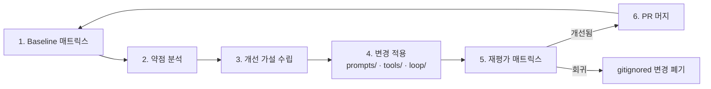

# PoC 운영 가이드

> **이 문서의 정체성**: 사외 환경에서 macro-logbot을 검증하기 위한 **재현 가능한 PoC 실행 매뉴얼**. Stage 2 spec §10(평가 설계)을 실제 실행 절차로 풀어 쓴 것. 다른 Claude Code가 본 가이드만 받아도 동일한 PoC를 돌릴 수 있어야 함.

## 1. 목적

| 항목 | 내용 |
|---|---|
| 검증 대상 | macro-logbot 시스템 — Agent Core + LLM Gateway + Tool System + Session |
| 측정 KPI | 자율 해결률 (full + partial) — Stage 2 spec §10.2 |
| 사내 대체 | Snake 게임 = MACRO 대체, 에러 카탈로그 = 사내 검증셋 대체, 무료 LLM = 사내 LLM 대체 |
| 사외 환경 신뢰도 | 시스템 무결성 검증의 약 80~90% (남는 변수: 사내 LLM의 reasoning 차이) |
| **핵심 미션** | **"약한 LLM 에서도 정확도를 끌어올리는 시스템 엔지니어링"** — macro-logbot의 가치는 LLM이 아니라 (Tool + 프롬프트 + agent loop + retrieval)에서 나옴 |

## 2. 폴더 구조

```
poc/
├── README.md                          # 운영 가이드 요약 (본 문서 link)
├── targets/                           # 테스트 대상 OSS
│   └── snake-game/
│       ├── original/                  # 원본 (MIT 클론, .gitkeep으로 자리만)
│       └── injected/                  # 에러 주입 변형 (스크립트 생성, .gitignore)
├── error_catalog/                     # 정답·주입 정의 (commit)
│   ├── E001-null-head.yaml
│   ├── E002-index-out-of-range.yaml
│   └── ...
├── reports/                           # 평가 결과 (.gitignore — 일부만 sample commit)
│   ├── 2026-MM-DD-<model>/
│   │   ├── case-<id>.json
│   │   └── summary.md
│   └── <date>-comparison.md
├── scripts/
│   ├── setup.sh                       # 1회: snake-game clone + venv
│   ├── inject.py                      # 카탈로그 → injected/ 생성
│   ├── trigger.py                     # injected 실행 + 에러 로그 캡처
│   └── evaluate.py                    # macro-logbot 매트릭스 호출 + 결과 저장
└── prompts/                           # 약한 LLM 강화용 system prompt iterations
    ├── v1-baseline.md
    ├── v2-cot-added.md
    └── ...
```

`.gitignore` 정책:
- `targets/snake-game/original/` — clone 결과, gitignore (재현 가능)
- `targets/snake-game/injected/` — 스크립트 생성, gitignore
- `reports/*/` — 큰 산출물, gitignore. 단 milestone 리포트는 별도 commit (`reports/milestone-*/`).

## 3. Snake 게임 setup

### 3.1 1회 setup

```bash
cd poc/
./scripts/setup.sh
```

`setup.sh` 내용:
```bash
#!/usr/bin/env bash
set -euo pipefail
cd "$(dirname "$0")/.."

# 1. Pygame Snake clone (MIT, ~200줄짜리 단순 클론)
SNAKE_REPO="https://github.com/<선정된-repo>/python-snake-game.git"  # 실제 선정 시 채움
mkdir -p targets/snake-game
git clone --depth 1 "$SNAKE_REPO" targets/snake-game/original

# 2. venv + pygame
python3 -m venv .venv
source .venv/bin/activate
pip install -r requirements.txt          # macro-logbot deps
pip install pygame                       # target deps

# 3. headless 실행 확인
SDL_VIDEODRIVER=dummy python targets/snake-game/original/snake.py --frames 30
echo "setup OK"
```

### 3.2 Headless 실행 원리

Pygame은 기본 GUI 필요지만 `SDL_VIDEODRIVER=dummy` 환경변수로 **headless 실행** 가능. CI·자동 평가 친화적.

## 4. 에러 카탈로그

### 4.1 카탈로그 schema

`poc/error_catalog/E<NNN>-<short-name>.yaml`:

```yaml
id: E001
short_name: null-head
category: runtime     # runtime | logic | type | env
severity: high        # 분석 난이도, not security severity

target_file: snake.py
target_function: update_position

# git apply 가능한 unified diff
injection_diff: |
  --- a/snake.py
  +++ b/snake.py
  @@ -40,7 +40,7 @@ class SnakeGame:
       def update_position(self):
  -        if self.head is not None:
  -            self.head.x += self.dx
  +        self.head.x += self.dx

# 에러 발생 트리거 명령
trigger:
  cmd: "SDL_VIDEODRIVER=dummy python snake.py --frames 30"
  expected_exit_code: 1
  timeout_seconds: 10

# 정답 (channel-by-channel 채점 가능하도록 구조화)
ground_truth:
  root_cause: "head 객체 미초기화 상태(None)에서 .x 속성에 접근하여 AttributeError 발생"
  root_cause_keywords:               # 키워드 기반 1차 매칭 (LLM-judge 보조)
    - "AttributeError"
    - "None"
    - "head"
    - "초기화" 또는 "init"
  location:
    file: snake.py
    function: update_position
    line: 42
  fix_hint: "init_game() 호출이 update_position() 보다 먼저 실행되도록 game loop 시작 부분에 guard 추가"
  expected_tool_calls:               # follow-up 채점 시 좋은 답이라면 호출했을 도구
    - grep_codebase    # head 초기화 위치 찾기
    - read_file        # init_game 함수 확인
```

### 4.2 Phase 1 카탈로그 10개

| ID | category | description |
|---|---|---|
| E001 | runtime | None object access → AttributeError |
| E002 | runtime | List index out of range |
| E003 | logic | Off-by-one in 충돌 감지 |
| E004 | type | TypeError (str + int) |
| E005 | runtime | KeyError (dict 잘못된 키) |
| E006 | logic | Reversed if condition |
| E007 | runtime | Division by zero |
| E008 | logic | Infinite loop (종료 조건 누락) |
| E009 | logic | Wrong variable assignment (score vs lives) |
| E010 | env | Encoding error (한글 처리) |

**카탈로그 갱신 정책**: 평가 사이클을 돌리며 macro-logbot이 너무 잘 풀거나(쉬움) 너무 못 푸는(난해) case가 보이면 카탈로그 PR로 보강.

## 5. 측정 환경 변수

PoC 실행 전 아래 환경 변수를 `.env` 또는 셸에 설정한다.

| 환경 변수 | 기본값 | 출처 | 설명 |
|---|---|---|---|
| `MACRO_LOGBOT_ENV` | (미설정) | PR #43 | `poc` 로 설정 시 workspace 확장 허용 게이트 활성화 — **PoC 필수** |
| `MACRO_LOGBOT_POC_WORKSPACE_ALLOWED` | `/tmp/poc-cases` | PR #43 | `MACRO_LOGBOT_ENV=poc` 활성화 시 Tool System 이 접근 허용하는 workdir 루트 |
| `MACRO_LOGBOT_MODEL_CONTEXT_LIMIT` | `16384` | PR #45 | agent loop 의 컨텍스트 토큰 상한. 80% watermark 초과 시 오래된 메시지 group 단위 pop. 사용 모델의 실제 context window 에 맞춰 조정 |
| `MACRO_LOGBOT_POC_CASES_ROOT` | `/tmp/poc-cases` | PR #44 | inject workdir 루트 — inject.py 가 `<case_id>-<RANDOM>/` 하위 폴더를 생성하는 기준 경로. docker-compose 에서 `:ro` mount 로 연결 |

> **보안 게이트**: `MACRO_LOGBOT_ENV=poc` 없이 실행하면 production fail-closed 모드 — Tool System 이 cwd 외부 경로 접근을 거부. PoC 측정 시에만 `poc` 로 설정할 것.

inject workdir 경로 패턴:
```
/tmp/poc-cases/<case_id>-<RANDOM>/   # PR #44 inject.py 생성
```
docker-compose 에서 `/tmp/poc-cases` 를 `:ro` 마운트하여 컨테이너에서 읽기 전용으로 접근.

---

## 6. 스크립트 사용법

### 6.1 inject.py — 에러 주입

```bash
# 단일 case
python poc/scripts/eval/inject.py --case E001

# 전체
python poc/scripts/eval/inject.py --all
```

동작:
1. `targets/snake-game/original/`을 `targets/snake-game/injected/<case-id>/`로 복사
2. 카탈로그의 `injection_diff`를 `git apply` (또는 patch)
3. 결과 디렉토리에 `case.yaml` 메타 사본 저장

### 6.2 trigger.py — 에러 발생·캡처

```bash
python poc/scripts/eval/trigger.py --case E001
```

동작:
1. `injected/<case-id>/` 디렉토리에서 카탈로그의 `trigger.cmd` 실행
2. exit code · stdout · stderr · stack trace 캡처
3. `injected/<case-id>/error_log.txt`에 저장
4. exit code 검증 (예상과 다르면 트리거 실패로 표시)

### 6.3 evaluate.py — 평가 매트릭스 자동 실행

```bash
# 모든 모델 × 모든 case
python poc/scripts/eval/evaluate.py --models all --cases all

# 특정 모델만 빠르게
python poc/scripts/eval/evaluate.py --models openai/gpt-oss-20b --cases E001 E002 E003

# Quick mode (test-engineer agent가 PR에서 호출)
python poc/scripts/eval/evaluate.py --quick   # cases 3개 × default model 1개만

# 세션 누적 모드 (PR #42 — 이전 --session-cumulative 에서 rename)
python poc/scripts/eval/evaluate.py --continue-session

# KB Ablation Study (KB on/off 3 모드 비교 — 약한 LLM 강화 사이클 핵심)
python poc/scripts/eval/evaluate.py --models all --cases all --kb-mode isolated      # KB off (baseline)
python poc/scripts/eval/evaluate.py --models all --cases all --kb-mode cumulative    # KB 누적 (운영 시뮬레이션)
python poc/scripts/eval/evaluate.py --models all --cases all --kb-mode pre-seeded    # KB 사전 채움 (운영 초기 시뮬레이션)
```

> **PR #42 변경사항**:
> - `--session-cumulative` → `--continue-session` 으로 rename
> - 페이로드 `temperature=0`, `seed=42` 자동 적용 (결정론적 재현)
> - 채점 공식: total 100 = 자동 30 (evaluate.py heuristic) + Claude judge 70 (§7.1 참조). 이전 4-channel 25%×4 대체.

동작 (한 case 기준):
1. `error_log.txt` + 카탈로그 메타를 macro-logbot 형식 페이로드로 변환 (`temperature=0`, `seed=42` 자동 포함)
2. `MACRO_LOGBOT_DEFAULT_MODEL` 환경변수로 LLM swap
3. macro-logbot에 POST `/events` → session_id 받음
4. session_id 분석 완료까지 polling (timeout 5분)
5. `/sessions/<id>/report`로 1차 리포트 GET
6. Follow-up 자동 질문 N개 (§7.2) 진행
7. 결과 저장:
   ```
   poc/reports/<date>-<model>/case-<id>.json
   ```

JSON schema (`case-<id>.json`):
```json
{
  "case_id": "E001",
  "model": "openai/gpt-oss-20b",
  "started_at": "...",
  "duration_seconds": 7.2,
  "tokens": {"input": 2100, "output": 850},
  "report": {
    "root_cause": "...",
    "related_code_refs": [{"file": "snake.py", "line": 42}],
    "confidence": 0.85,
    "reasoning_summary": "..."
  },
  "tool_calls": [
    {"tool": "grep_codebase", "args": {...}, "result_summary": "..."},
    ...
  ],
  "followup": [
    {"q": "왜 그 위치라고 보세요?", "a": "..."},
    ...
  ]
}
```

## 7. 채점 (Claude Code judge)

### 7.1 채점 공식 (Stage 2 spec §10.1 동일)

**total = 100 = 자동 30 (evaluate.py heuristic) + Claude judge 70 (의미적)**

#### 자동 채점 — 30점 (evaluate.py, gating)

| 평가 항목 | 점수 | 채점자 |
|---|---|---|
| 도구 호출 성공 (iter > 1, tool 응답 받음) | 5 | 결정론적 스크립트 (`evaluate.py`) |
| structured Report 생성 (location ≠ None) | 5 | 결정론적 스크립트 |
| file:line 추출 정확 (heuristic match) | 10 | 결정론적 스크립트 |
| tool 사용 적절 (expected_tool_calls 일치) | 10 | 결정론적 스크립트 |

#### Claude Code judge — 70점 (의미적 채점, 본 §7.3 흐름)

**root_cause 의미 정확성 (40점)**:

| 등급 | 점수 | 기준 |
|---|---|---|
| 상 | 40 | error class + 원인 변수/함수 모두 정확. 사용자가 한 줄로 문제 인지 가능 |
| 중 | 20 | error class 정확, 원인 추정 부분만 (추가 디버깅 필요) |
| 하 | 5 | 잘못된 분석 / traceback keyword 반복 |

**fix_hint 구체성 (30점)**:

| 등급 | 점수 | 기준 |
|---|---|---|
| 상 | 30 | 구체적 코드 변경 (즉시 patch 가능). before/after 또는 정확한 변수/함수/line |
| 중 | 15 | 일반적 fix (e.g., "guard 추가") |
| 하 | 5 | 모호 (e.g., "코드 검토 권장") |

> 이전 4-channel 25%×4 방식 대체. `evaluate.py` 의 자동 채점은 30점 부분만 측정. Claude judge 70점은 별도 단계 (수동 또는 후속 자동화).

case별 종합 분류 (100점 만점):
- `full`: 85점 이상
- `partial`: 45~84점
- `fail`: 44점 이하

### 7.2 Follow-up 자동 질문 세트 (모든 case 공통)

```
Q1. "이 원인의 근거를 좀 더 자세히 설명해줘. 어떤 도구·코드를 보고 판단했어?"
Q2. "다른 가능한 원인은 없을까? 그것을 배제한 근거는?"
Q3. "어떻게 수정하면 좋을까? 코드 변경 예시를 보여줘."
```

세 답변을 받으면 한 case의 follow-up data 완성.

### 7.3 Claude Code judge 실행 흐름

1. `evaluate.py` 완료 후 자동 채점 30점 기록된 JSON 생성 (case당 1개)
2. 사용자가 main session(이 세션)에 명령:
   > "poc/reports/2026-MM-DD/ 결과 채점해줘"
3. main session이 모든 `case-<id>.json` + 해당 `error_catalog/<id>.yaml` 읽음
4. 각 case별 Claude judge 70점 채점 (spec §10.1 rubric 적용):
   - **root_cause 의미 정확성 (40점)**: report.root_cause vs ground_truth.root_cause 의미 비교 → 상(40)/중(20)/하(5) 등급 부여. error class가 같더라도 원인 변수·함수까지 맞아야 상.
   - **fix_hint 구체성 (30점)**: report.fix_hint 검토 → 즉시 patch 가능 수준이면 상(30), 일반 방향 제시면 중(15), 모호하면 하(5).
5. 자동 30 + judge 70 합산 → case별 `full`/`partial`/`fail` 분류
6. 결과를 `poc/reports/<date>/comparison.md`로 작성

### 7.4 비교 리포트 형식

```markdown
# macro-logbot PoC 평가 결과 — <date>

## 자율 해결률
| 모델 | full | partial | fail | 자율해결률 | 평균 분석 시간 | 평균 토큰 |
|---|---|---|---|---|---|---|
| Gemini Flash | 7 | 2 | 1 | 90% | 5.2s | 2,300 |
| gpt-4o | 6 | 3 | 1 | 90% | 6.8s | 2,800 |
| Claude Haiku | 8 | 1 | 1 | 90% | 4.9s | 2,100 |
| Local LLM (약한 baseline) | 4 | 2 | 4 | 60% | 1.8s | 1,600 |

## 케이스별 매트릭스
| Case | Gemini | gpt-4o | Claude Haiku | Local LLM |
|---|---|---|---|---|
| E001 | ✅ full | ✅ full | ✅ full | ⚠️ partial |
| ... | ... | ... | ... | ... |

## 약점 분석 (categorical)
- Local LLM: environment(E010) 카테고리에서 약함
- 모든 모델: off-by-one(E003) 난해 — Tool 개선 여지

## 약한 LLM 강화 사이클 — 이번 iteration
- 시작: Local LLM 50%
- 변경: prompts/v3-cot.md 적용 + retrieval prefetch 도입
- 결과: 60% (+10%p)
- 다음 시도: ...
```

### 7.5 측정 인프라 invariant (false positive 재발 방지)

**Why**: PR #51 (N=10 baseline 보고서) 가 "F2 (workspace boundary) 해소 ✅" 결론을 **false positive** 로 머지함. 실제로는 backend container 의 `read_file`/`grep_codebase` 가 모두 `Permission denied` 였음에도, 1-A heuristic 의 file_match/line_match 가 agent 의 **traceback echo** 만으로 통과했기 때문 (PR #52 으로 인프라 자체는 fix). 재발 방지를 위해 본 invariant 를 측정 절차의 일부로 명문화.

**측정 결과를 신뢰하기 위한 4 가지 invariant**:

1. **Tool 호출 결과 success rate ≥ 80%**
   - session DB (`.macro-logbot-sessions.db`) 의 messages 중 `role="tool"` 의 content 에 `"error"` key 가 있는 비율 < 20%
   - evaluate.py 의 fail-fast guard 가 자동 검출 (§7.5.1)
2. **traceback echo 와 코드 read 의 구별**
   - 1-A heuristic 의 file_match/line_match 가 통과한 case 중, agent 의 tool_calls 가 0 회 또는 모두 error 이면 **traceback echo 로 분류**
   - 본 case 는 "F2 해소" 의 증거로 채택 금지
3. **structured Report 의 채움 경로 구별**
   - `report.location.file/line` 이 채워졌어도 **traceback fallback** 인지 **코드 read 후 도출** 인지 구별
   - crystallize 의 fallback log 또는 tool_calls history 검증
4. **deterministic 검증**
   - 같은 fixture (E*.yaml) + 같은 seed (42) 에서 N>1 run 의 1-A variance 가 std > 0.3 이면 sampling stochasticity 의심
   - LM Studio Local 모델 일부는 `seed` parameter 를 무시 — 사용 모델·환경별 결정성 별도 검증

#### 7.5.1 evaluate.py fail-fast guard (자동 invariant 1)

`evaluate_case` 가 backend response 를 받은 직후 다음 검사를 수행. **단일 source of truth = `poc/scripts/evaluate.py` 의 `TOOL_ERROR_SENTINELS` 상수** (본 doc 의 예시는 가독성용 mirror, 코드 변경 시 본 doc 도 동기화).

```python
# Tool error sentinel — backend container 가 workspace 접근 실패한 경우
TOOL_ERROR_SENTINELS = (
    "Permission denied",
    "PermissionError",
    "not a file:",
    "[Errno 13]",
)
sentinel_hits = [s for s in TOOL_ERROR_SENTINELS if s in analysis_text]
if sentinel_hits:
    result["infra_error"] = {
        "sentinels_hit": sentinel_hits,
        "reason": "backend tool 호출이 fail (workspace permission 등 인프라 문제)",
    }
    # 본 case 는 1-A score 가 통과해도 measurement infra 문제로 분류
```

본 guard 의 hit 여부는 case 결과 JSON 의 `infra_error` key 로 기록. 비교 보고서 작성 시 본 flag 가 있는 case 는 신뢰 어려운 측정으로 disclaim.

#### 7.5.2 session DB 검증 (수동 invariant 2/3)

비교 보고서 작성 전, 다음 명령으로 tool result success rate 측정:

```bash
docker exec macro-logbot-backend python3 -c "
import sqlite3, json
conn = sqlite3.connect('/app/.macro-logbot-sessions.db')
ok = err = 0
for (blob,) in conn.execute('SELECT messages_json FROM sessions ORDER BY updated_at DESC LIMIT 30'):
    for m in json.loads(blob):
        if m.get('role') == 'tool':
            if '\"error\"' in (m.get('content','')[:50]): err += 1
            else: ok += 1
print(f'tool success: {ok}/{ok+err} = {ok/(ok+err)*100:.1f}%')
"
```

본 검증의 success rate < 80% 면 measurement 인프라 문제 의심.

### 7.6 본 Claude main session 의 평가 워크플로우 (보고서 작성 전 체크리스트)

**Why**: PR #51 (N=10 보고서) 의 false positive 결론이 본 main session 의 측정 검증 부재 때문이었음. 보고서 작성 전 다음 체크리스트 강제.

#### 7.6.1 측정 raw output 검증 (필수, 보고서 작성 전)

- [ ] `poc/reports/<date>/<case>.json` 의 `score_1a.naive_score_0_to_1` 분포 확인 — variance 큰 case (std > 0.3) 식별
- [ ] **§7.5.2 의 session DB tool result success rate ≥ 80%** 확인
- [ ] **§7.5.1 의 `infra_error` flag 가 있는 case 제외** — fail-fast guard 가 표시한 case 는 score 무효
- [ ] file_match/line_match=True 인 case 중 tool_calls=0 또는 모두 error 인 case 식별 → **"traceback echo" 로 분류, "F2 해소" 증거에서 제외**

#### 7.6.2 결론의 disclaim 의무

- [ ] "F2 해소", "자율분석 X%", "structured Report Y%" 같은 결론은 §7.6.1 의 4 가지 invariant 통과 후에만 작성
- [ ] **한 invariant 라도 실패 시** 보고서에 **명시적 disclaim** 추가. 예시:
  - "tool result success rate 0% — 본 측정의 F2/2-A 결론은 인프라 문제로 신뢰 어려움"
  - "1-A heuristic 의 file:line 매칭은 traceback echo 가능성 — 코드 read 기반 분석 능력 측정 아님"
- [ ] median run 채점 시 **선택된 run number** (예: `E001 → N5`) 명시 — reproducibility 보장

#### 7.6.3 본 sprint 교훈 적용 (PR #51 → PR #52 → PR #53)

PR #51 의 §3 표 "F2 해소 ✅ (tool 호출 시도 100%)" 가 본 invariant 의 **#1 (tool 결과 success rate)** 를 검증 안 한 직접 결과. "tool 호출 시도" 와 "tool 호출 성공" 을 구별 안 한 conflate. 향후 보고서는 본 invariant 통과 evidence 없이는 "해소" 표현 사용 **금지**.

## 8. 약한 LLM 강화 사이클 (핵심 미션)

### 8.1 사이클 정의



### 8.2 개선 전략 카탈로그

각 사이클에서 다음 중 하나(또는 조합) 적용:

| 전략 | 위치 | 효과 가설 |
|---|---|---|
| **System prompt 강화** | `poc/prompts/v<N>-<name>.md` | 분석 절차·출력 형식·CoT 강제 |
| **Few-shot examples** | system prompt 안 | 비슷한 에러의 좋은 분석 예시 1~3개 |
| **Tool description 개선** | MCP 서버 도구 metadata | LLM이 도구 선택을 더 정확히 |
| **Composite tool 추가** | `src/tools/` | 예: `find_likely_cause`가 grep+read+blame 묶음 |
| **Retrieval prefetch** | Agent Core | 에러 키워드로 자동 grep, 컨텍스트 주입 |
| **Self-critique node** | LangGraph state graph | 답변 전 LLM에 자기 검토 강제 |
| **Structured output schema** | LLM 호출 시 `response_format` | JSON schema 강제 |
| **Max iterations 조정** | env var | 너무 적으면 미완 / 너무 많으면 noise |

### 8.3 사이클 PR 단위

각 사이클은 별도 PR:
- 브랜치: `experiment/<name>-cycle-<N>` (예: `experiment/cot-cycle-2`)
- PR description에 (1) 가설 (2) 변경 내용 (3) 사전 baseline 수치
- test-engineer agent가 `evaluate.py --quick` 실행 후 결과 차이 자동 비교
- 개선 폭이 의미 있으면 (Δ ≥ +5%p) verifier가 머지 승인

### 8.4 사이클 종료 조건

- 약한 baseline LLM 자율 해결률 ≥ 60% 달성 시
- 또는 한 사이클 적용 후 Δ < 1%p (개선 없음)이 3회 연속

종료 후 모든 사이클 시도·결과를 `poc/reports/cycles-summary.md`로 정리.

### 8.5 KB 누적 효과 (Ablation 측정)

약한 LLM 강화 사이클에서 Knowledge Base(KB §5.5)의 기여는 별도 측정. 시간이 지나며 KB가 baseline을 어떻게 끌어올리는지 정량화.

**측정 방법** (Stage 2 spec §10.6에 동일 정의):
- `--kb-mode isolated`: KB 비활성 baseline
- `--kb-mode cumulative`: case 처리하며 KB 점진 누적
- `--kb-mode pre-seeded`: ground_truth로 KB 사전 채움

**기대 효과**:
- Cumulative와 isolated의 Δ = "운영 시 자연 누적이 가져오는 효과"
- Pre-seeded와 isolated의 Δ = "사내 운영팀이 과거 사례를 초기 KB에 등록할 가치"
- 약한 LLM 에서 Δ가 가장 큰 것이 기대 결과 — 검증되면 macro-logbot 시스템 엔지니어링 가치 명확

**사이클과의 통합**:
- 사이클 PR마다 3 모드 모두 측정 → `poc/reports/<cycle-id>/comparison.md`에 9 column 매트릭스 (3 KB mode × 3 단계: 사이클 전 / 사이클 적용 / 사이클 후)
- 사이클이 KB 활용 전략을 개선하면 cumulative·pre-seeded 모드에서 Δ 증가가 우선 관찰됨

## 9. 운영 후 사내 적용 (v1.0 → 운영)

사외 PoC가 baseline 충족하면:
1. **사내 LLM endpoint 정보 확보** (사내 LLM 운영팀 답변 — `docs/requirements/02-사내-사전확인-체크리스트.md` 섹션 A)
2. **사내 환경에 clone + deploy** (단방향)
3. **사내 검증셋 N건으로 재평가** (사내 데이터, 외부 누출 금지)
4. **자율 해결률 ≥ 70% 달성 검증** (Stage 2 spec §10.2 운영 목표)
5. 미달 시 → 약한 LLM 강화 사이클을 사내 LLM 대상으로 재진행

### 9.1 사내 LLM endpoint 설정 (`.env`)

```bash
# 사내 LLM
MACRO_LOGBOT_LLM_BASE_URL=https://<사내-llm-endpoint>/v1
MACRO_LOGBOT_LLM_API_KEY=<사내-api-key>
MACRO_LOGBOT_LLM_PROVIDER=openai           # 또는 사내 provider (vLLM, TGI 등)
MACRO_LOGBOT_DEFAULT_MODEL=<사내-model-id>   # 예: company-llm-13b
MACRO_LOGBOT_MODEL_CONTEXT_LIMIT=<context-len>  # 사내 모델의 context window

# (task-AGENT-024) gpt-oss / o1 류 reasoning model 한정 — 비-reasoning model 은 영향 0.
# LM Studio UI 의 Low/Medium/High 슬라이더 = OpenAI compat reasoning_effort parameter.
# 사용자 검증 (2026-05-21): gpt-oss-20b + reasoning_effort=high 응답에 reasoning 필드 분리,
# usage.completion_tokens_details.reasoning_tokens 별도 카운트.
# 잘못된 값은 LLMGateway.__init__ 에서 ValueError fail-fast.
MACRO_LOGBOT_LLM_REASONING_EFFORT=high          # low / medium / high (chain-of-thought 깊이)
MACRO_LOGBOT_LLM_TIMEOUT_SEC=900                # LLM 호출 timeout (초). high effort 시 900+ 권고

# 측정 환경 (사외와 동일)
MACRO_LOGBOT_ENV=poc
MACRO_LOGBOT_POC_WORKSPACE_ALLOWED=/tmp/poc-cases
MACRO_LOGBOT_API_KEY=<원하는-bearer-key>
MACRO_LOGBOT_AUTH_REQUIRED=true
```

backend container 재기동:
```bash
docker compose down && docker compose up -d
docker compose logs -f backend  # healthy 확인
```

### 9.2 측정 실행 (one-shot 스크립트)

repo 의 `poc/scripts/run-onprem-baseline.sh` (PR #54 신규, PR #57 robustness 강화):

#### 9.2.1 env file (`.env`)

스크립트가 `.env` 를 load — 사외/사내 동일.

**이전 `.env.bak` 정책 폐기 (2026-05-21)**: "사외 dev 의 pytest 충돌 회피" 가설은 본 PoC 의 `pyproject.toml` / `conftest.py` 에서 dotenv 자동 load 설정 0 → 가설 무근거 검증. `.env` 단일화로 사내·사외 환경 일치 + 운영자 혼란 제거.

`.env` 없으면 fail-fast.

#### 9.2.2 host Python 자동 검출 (PYTHON_BIN env override → `.venv` → system)

본 스크립트는 host Python 으로 `evaluate.py` 실행. 의존성:
- Python **3.8+** (PoC 스크립트는 stdlib + yaml 만 사용, pyproject 의 `requires-python = ">=3.14"` 는 backend 의존)
- `pyyaml` 패키지

**검출 순서** (script 가 자동):
1. `PYTHON_BIN` env var 명시 — 사용자 override
2. `${REPO_ROOT}/.venv/bin/python3` 실행 가능 시 — 사외 dev 환경 자동
3. system `python3` — 사내 운영 환경 (사내 default Python)

**사내 host 가 Python 3.14 미지원**이면:
```bash
# 1. host 의 사용 가능한 Python 확인
python3 --version   # 또는 python3.11, python3.12

# 2. PyYAML 설치 (user-only — 시스템 영향 0)
python3 -m pip install --user pyyaml

# 3. 그대로 실행 — 자동 검출이 system python3 사용
./poc/scripts/run-onprem-baseline.sh 3

# 또는 명시 override
PYTHON_BIN=python3.11 ./poc/scripts/run-onprem-baseline.sh 3
```

#### 9.2.3 기본 실행

```bash
cd /path/to/macro-logbot
./poc/scripts/run-onprem-baseline.sh        # N=3, default
./poc/scripts/run-onprem-baseline.sh 5      # N=5
./poc/scripts/run-onprem-baseline.sh 3 E001,E002,E003  # subset cases
```

#### 9.2.4 env override (사내 환경 맞춤)

| env | default | 의미 |
|---|---|---|
| `PYTHON_BIN` | (자동 검출: `.venv/bin/python3` → system `python3`) | host Python override |
| `MACRO_LOGBOT_BACKEND_CONTAINER` | (자동 검출: `docker compose ps -q macro-logbot-backend`) | docker-compose service 이름 다를 때 |
| `RATE_LIMIT_COOLDOWN` | `0` | 사내 LLM rate limit 시 case 간 sleep (sec) — 예: `RATE_LIMIT_COOLDOWN=2` |

내부 동작 = `poc/scripts/evaluate.py` 를 N 회 반복 + 측정 시작 시각 `started_at` 캡쳐 (invariant 의 session 범위 제한) + run 별 log 분리 (`run-N{1..N}.log`) + 진행상황 화면 출력 (tee).

### 9.3 결과 위치

- **raw output**: `/tmp/baseline-onprem-<YYYYMMDD>-<HHMMSS>/reports/N{1..N}/<YYYY-MM-DD>/E*.json`
- **run log** (run 별 분리): `/tmp/baseline-onprem-<TS>/run-N{1..N}.log`
- **started_at.txt**: 측정 시작 시각 UTC ISO 8601 (invariant SQL 의 session 범위 제한용)
- **invariant-check.txt**: §7.5 invariant 자동 검증 결과 (PR #57 fix — JSON parse + session 범위 제한)
- **comparison.md** (자동 생성): 각 run 의 `reports/N{N}/<YYYY-MM-DD>/comparison.md`

§7.5 invariant 검증:
```bash
docker exec <backend-container> python3 -c "
import sqlite3, json
conn = sqlite3.connect('/app/.macro-logbot-sessions.db')
ok = err = 0
for (blob,) in conn.execute('SELECT messages_json FROM sessions ORDER BY updated_at DESC LIMIT 30'):
    for m in json.loads(blob):
        if m.get('role') == 'tool':
            if '\"error\"' in (m.get('content','')[:50]): err += 1
            else: ok += 1
print(f'tool success: {ok}/{ok+err} = {ok/(ok+err)*100:.1f}%')
"
# 결과 < 80% 면 인프라 문제 — 사외와 같은 문제 의심, fix 후 재측정
```

### 9.4 사외 Claude 와 공유 (raw JSON 전달)

본인 (사외 main Claude) 이 4-channel judge + 비교 보고서 작성하려면 raw JSON 30 개 필요.

**Secret redact 후 전달**:
```bash
ROOT=/tmp/baseline-onprem-<YYYYMMDD>

# 1. hostname / 사내 IP 패턴 redact
sed -i -E 's/[a-zA-Z0-9-]+\.<사내-domain>/<host-redacted>/g; s/10\.[0-9.]+/<ip-redacted>/g' \
    $ROOT/reports/*/<YYYY-MM-DD>/*.json

# 2. 사내 사용자명 / 경로 redact
sed -i -E 's/\/home\/<사내-user>/\/home\/<user>/g' $ROOT/reports/*/<YYYY-MM-DD>/*.json

# 3. 사내 모델 ID 가 secret 이면 redact (optional)
# sed -i 's/<사내-model-id>/<model-redacted>/g' $ROOT/reports/*/<YYYY-MM-DD>/*.json

# 4. tar.gz 압축
tar czf onprem-baseline-$(date +%Y%m%d).tar.gz -C $ROOT reports/
```

본 tar.gz 만 사용자 PC 로 복사 → conversation 에 첨부. 사외 Claude 가 §7.5 invariant 재검증 + §7.1 의 30+70 채점 + N=3 (사외 Local Gemma) vs 사내 LLM 비교 보고서.

## 10. 본 PoC를 다른 Claude Code가 재현하는 법

본 가이드 외에 필요한 것:
- `docs/process/03-개발-프로세스.md` (자동화 매뉴얼)
- `docs/design/02-설계문서.md` (시스템 설계)
- 무료 LLM 4종 API key (사용자 발급)

재현 단계:
```bash
git clone https://github.com/simsimhugh/macro-logbot.git
cd macro-logbot
# 환경변수 셋업 (.env.example 참조)
cp .env.example .env
# 4개 API key 입력
nano .env

# Stage 3 구현이 완료된 시점이면 바로 PoC 실행
./poc/scripts/setup.sh
python poc/scripts/inject.py --all
python poc/scripts/evaluate.py --models all --cases all

# Claude Code 세션에서:
# > "poc/reports/<date>/ 결과 채점해줘"
```

각 단계가 막히면 어느 문서를 보아야 하는지:
- 환경 setup → `CONTRIBUTING.md`
- 시스템 구조 이해 → `docs/design/02-설계문서.md`
- PR·머지 자동화 → `docs/process/03-개발-프로세스.md`
- 사이클 운영 → 본 문서

## 11. 본 문서 갱신 정책

- 카탈로그 추가·제거: `docs/<...>` 브랜치 PR
- 채점 방식 변경: `meta` label, 사람 final review 권장 (재현 안정성 영향)
- 사이클 결과: `poc/reports/cycles-summary.md`에 누적 기록
