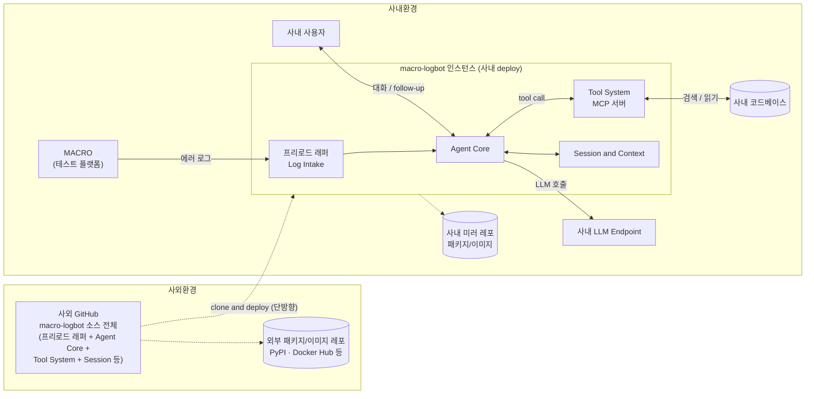
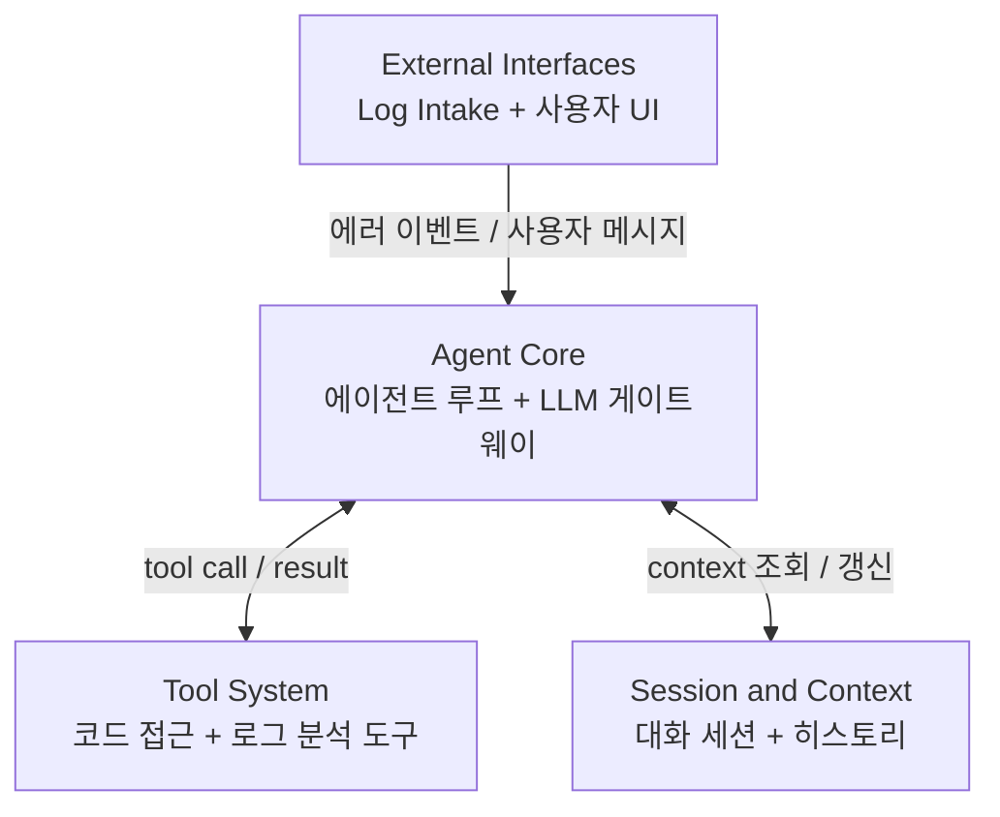
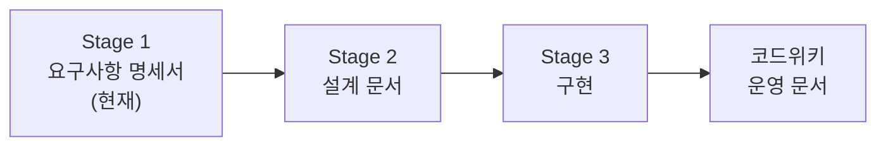

# 요구사항 명세서: macro-logbot

## 1. 문서 정보
| 항목 | 내용 |
|---|---|
| 프로젝트명 | macro-logbot |
| 단계 | Stage 1/3 — 요구사항 명세서 |
| 버전 | 0.4 |
| 작성일 | 2026-05-15 |
| 작성자 | macro-logbot 프로젝트팀 |
| 최종 모호도 | 10% (threshold 20% 통과) |

## 2. 개요 (Background)

macro-logbot은 **사내 에이전트 AI 플랫폼**이다. 첫 번째 사용 사례는 사내 테스트 플랫폼 **MACRO**에서 발생하는 **에러 원인 자율 분석**이며, 점진적으로 다른 코드/로그 관련 작업으로 확장 가능한 구조를 가진다. 봇 이름 `macro-logbot`은 "MACRO 플랫폼의 log를 다루는 bot"에서 유래한다.

작동 방식은 Claude Code와 유사하다 — LLM이 도구(코드 검색, 로그 조회 등)를 **자율적으로 다중 호출**하며 단서를 모아 결론을 도출한다(Iterative agent loop). 분석 후에는 사용자가 follow-up 질문을 이어갈 수 있는 대화 세션을 유지한다.

## 3. 목표 (Goals)

- G-1: MACRO에서 발생한 에러의 원인을 **자율적으로** 분석해 리포트를 생성한다
- G-2: 리포트를 기반으로 follow-up 질문이 가능한 **대화 세션**을 제공한다
- G-3: **코드 + 로그를 결합한 분석**으로 정확도를 높인다
- G-4: 사내 LLM·사내 코드베이스와 안전하게 연동한다
- G-5: 향후 다른 사내 use case로 확장 가능한 **에이전트 플랫폼**으로 진화시킨다

## 4. 범위 (Scope)

### 4.1 포함 (In-Scope)
- MACRO → macro-logbot 로그 수신 채널 (Log Intake)
- 로그+코드를 결합한 **iterative 자율 원인 분석**
- 분석 리포트 생성 및 follow-up 대화 세션
- 사내 LLM endpoint 연동 (모델 교체 가능)
- 관리자가 지정한 사내 코드베이스 접근
- 사외/사내 배포 환경별 의존성 소스 전환 메커니즘

### 4.2 제외 (Non-Goals)
- 자동 코드 수정/패치 (분석까지, 수정은 사람의 일)
- MACRO 자체의 수정
- 다국어 UI (한국어/영어 외 추가 없음)

## 5. 시스템 컨텍스트 (System Context)

**핵심 포인트**:
- macro-logbot **자체**의 모든 모듈(프리로드 래퍼, Agent Core, Tool System, Session 등)은 사외 GitHub에서 개발·관리.
- 사외 환경에서는 외부 공개 레포(PyPI · Docker Hub 등)에서 의존성을 받음.
- 사내 환경에서는 외부 인터넷 격리로 인해 **사내 미러 레포**에서만 의존성을 받음.
- **분석 대상** 코드/로그는 사내 환경 밖으로 절대 유출되지 않음.
- 사외 → 사내는 `clone` 단방향. **사내 → 사외 푸시 불가** (제약 C-5).

## 6. 이해관계자 (Stakeholders)

| 역할 | 책임 |
|---|---|
| Maintainer | macro-logbot 본체를 사외 환경에서 개발/관리, 사내 클론 및 평가 |
| MACRO 운영자 | macro-logbot에 에러 로그 송신 연동 |
| 사내 개발자 (end user) | 에러 발생 시 macro-logbot 리포트 활용, follow-up 질의 |
| 사내 LLM 운영팀 | LLM endpoint 제공 |
| 사내 인프라·미러 운영팀 | 사내 미러 레포 운영, 누락 의존성 등록 지원 |

## 7. 기능 요구사항 (Functional Requirements)

| ID | 요구사항 | 우선순위 |
|---|---|---|
| FR-1 | MACRO에서 송신한 에러 로그를 안전하게 수신 (Log Intake) | High |
| FR-2 | 로그 수신 시 분석 세션을 시작, LLM이 도구를 자율적으로 호출하며 원인을 추적 (iterative agent loop) | High |
| FR-3 | 분석 결과를 구조화된 리포트로 출력 (원인 추정 · 관련 코드 위치 · 신뢰도) | High |
| FR-4 | 리포트 생성 후 사용자가 follow-up 질문을 이어갈 수 있는 대화 세션 제공 | High |
| FR-5 | 대화 세션 중에도 LLM이 도구를 호출하여 답변 가능 | High |
| FR-6 | 관리자가 지정한 사내 코드베이스를 도구를 통해 검색/조회 | High |
| FR-7 | 사내 LLM endpoint를 통해 LLM 호출, **모델 교체 가능** | High |
| FR-8 | 분석 세션별로 도구 호출 이력과 추론 과정을 로깅 | Medium |

## 8. 비기능 요구사항 (Non-Functional Requirements)

| ID | 요구사항 | 측정/기준 |
|---|---|---|
| NFR-1 | **자율 해결률** (핵심 KPI) | 사내 검증셋(과거 에러 + 정답) 기준 자동 채점. 1차 목표 수치는 PoC 후 설정 |
| NFR-2 | 보안 | 분석 대상 코드·로그는 사내 환경 외부로 유출 금지 (네트워크 감사로 검증). Tool System 의 파일 접근은 workspace 경로 격리 (`_safe_resolve`) 로 제한 — symlink escape 차단, secret blocklist, 환경 게이트(`MACRO_LOGBOT_ENV`) 로 PoC/production 접근 범위 분리 (설계문서 §12.4) |
| NFR-3 | 확장성 | Tool System(MCP)이 새 도구 추가에 열린 구조 |
| NFR-4 | 모델 독립성 | LLM 모델 교체 시 코드 변경 없이 endpoint 설정만으로 가능 |
| NFR-5 | 응답성 | PoC 단계에서 목표 응답 시간 정의 예정 |
| NFR-6 | **환경별 배포 가능성 (Deployment Portability)** | 패키지·이미지 의존성 소스를 환경(사외/사내) 별로 **설정만으로 전환 가능**. 코드 변경 없이 환경 변수 또는 설정 파일로 사내 미러 레포로 스위치 |

## 9. 제약사항 (Constraints)

- C-1: LLM endpoint는 **사내 전용** (외부 API 호출 금지)
- C-2: 분석 대상 코드·로그는 **사내 환경 외부로 유출 금지**
- C-3: macro-logbot **자체** 코드는 **사외 GitHub**에서만 개발/관리 (OSS 최대 활용, 자체 개발은 사내 환경 래퍼만)
- C-4: 운영은 **사내 클론 → deploy** 방식
- C-5: **사내 → 사외 GitHub 푸시 불가**. 코드/이슈/PR 흐름은 사외 → 사내 단방향 `clone`만 허용 (운영 중 발견된 수정사항은 사외 환경에서 재현·반영 필요)
- C-6: **사내 환경은 외부 인터넷 패키지/이미지 레포 접근 불가.** 모든 외부 의존성(Docker 이미지·Python·기타 패키지)은 **사내 미러 레포**에서 받아야 함. 사외 환경에서는 외부 공개 레포(PyPI · Docker Hub 등) 사용

## 10. 가정사항 (Assumptions)

- A-1: 사내에 검증용 데이터(과거 에러 + 밝혀진 원인)가 충분히 존재
- A-2: 사내 LLM이 multi-turn tool calling을 지원 (또는 가까운 시일 내 지원 예정)
- A-3: 관리자가 macro-logbot에 코드 접근 권한 부여 가능
- A-4: MACRO가 로그 송신용 인터페이스(예: HTTP webhook)를 추가할 수 있음
- A-5: 사내 미러 레포가 macro-logbot 필요 의존성(베이스 이미지, Python 패키지, 사용 OSS 등)을 제공한다. 누락된 의존성은 사내 인프라·미러 운영팀에 요청해 등록 가능

## 11. Topology — 탑레벨 컴포넌트

| 컴포넌트 | 책임 | 구현 방향 (후보) |
|---|---|---|
| External Interfaces | MACRO 로그 수신, 사용자 채팅 진입점 | **프리로드 래퍼(자체 개발)** + 챗봇 UI (Open WebUI 후보) |
| Agent Core | LLM 호출 + iterative tool calling 루프 + 사내 LLM 게이트웨이 | OSS 후보 평가 필요 (Open WebUI / 기타 에이전트 OSS) |
| Tool System | 사내 코드베이스 검색·읽기, 로그 분석 도구 | **MCP 서버** (후보) |
| Session & Context | 대화 세션, follow-up 질문 컨텍스트 유지 | Agent Core가 의존하는 OSS 내장 기능 활용 |

## 12. 인수 기준 (Acceptance Criteria)

- [ ] AC-1: 검증셋의 임의 에러 로그를 입력하면, 사람 개입 없이 원인 분석 리포트가 생성된다
- [ ] AC-2: 리포트 생성 후 follow-up 질문에 대해 LLM이 추가 도구 호출을 통해 답변한다
- [ ] AC-3: 분석 과정에서 코드·로그가 사내 환경 외부로 유출되지 않는다 (네트워크 트래픽 감사 통과)
- [ ] AC-4: 사내 LLM endpoint 모델을 교체해도 정상 동작 (회귀 테스트 통과)
- [ ] AC-5: 검증셋 기준 자율 해결률을 자동 측정하는 평가 스크립트가 존재한다. 채점은 **total = 100 = 자동 30점 (evaluate.py heuristic) + Claude judge 70점 (의미적)** — 자동: 도구 호출 5 + 리포트 생성 5 + file:line 추출 10 + tool 사용 적절 10; judge: root_cause 정확성 상40/중20/하5 + fix_hint 구체성 상30/중15/하5. 이전 4-channel 25%×4 대체 (설계문서 §10.1, PoC 가이드 §7.1 채점 공식 + §7.3 Claude Code judge 흐름)
- [ ] AC-6: **사내 환경 배포 시 빌드·런타임이 사내 미러 레포만으로 성공한다** (외부 인터넷 차단된 상태에서 외부 레포 접근 시도 없음)

## 13. 용어 정의 (Glossary)

| 용어 | 정의 |
|---|---|
| MACRO | 사내 테스트 플랫폼. macro-logbot이 분석하는 에러 로그의 발생원 |
| 자율 해결 (Autonomous resolution) | 사람 개입 없이 LLM이 도구 호출과 추론만으로 원인 도출까지 완성 |
| Iterative agent loop | LLM이 응답마다 도구를 호출하고, 결과를 보고 다시 추론해 다음 도구를 호출하는 다중 턴 흐름 (Claude Code 방식) |
| 사내 LLM endpoint | 사내망에서만 접근 가능한 LLM API. 모델 교체 가능 |
| 검증셋 | 사내 보유 "과거 에러 로그 + 밝혀진 원인" 쌍 데이터 |
| MCP | Model Context Protocol — LLM이 외부 도구를 표준 인터페이스로 호출하는 프로토콜 |
| OSS | Open Source Software — 오픈소스 소프트웨어 |
| Open WebUI | 오픈소스 챗봇 UI. 사용자와 LLM의 대화 인터페이스 |
| 프리로드 래퍼 | MACRO → macro-logbot 진입 어댑터. 자체 개발 영역 |
| 사내 미러 레포 (Internal Mirror) | 외부 인터넷 격리된 사내 환경에 의존성(Docker 이미지 · Python 패키지 · OSS 등)을 제공하는 사내 운영 레포 |

## 14. 미해결 항목 (Open Questions)

| ID | 질문 | 영향 |
|---|---|---|
| OQ-1 | 사내 LLM이 multi-turn tool calling을 지원하는가? | 핵심 가정 검증 — 안 되면 아키텍처 재설계 |
| OQ-2 | Agent Core OSS 후보(Open WebUI / OpenDevin / Goose / 기타) 중 어느 것이 사내 LLM과 호환되는가? | 설계 문서 단계에서 비교 평가 |
| OQ-3 | 자율 해결률 1차 목표 수치 (예: 30% / 50% / 70%) | NFR-1 구체화 |
| OQ-4 | 응답 시간 목표 | NFR-5 구체화 |
| OQ-5 | 동시 분석 세션 수 (확장성 요구) | NFR-3 구체화 |
| OQ-6 | C-5 환경에서 사내 운영 중 발견된 버그/개선점을 사외 개발에 어떻게 환류할 것인가 (운영 회수 채널 설계) | Stage 2 운영 설계 |
| OQ-7 | 후보 OSS(Open WebUI · MCP 서버 등)와 그 의존성이 **사내 미러에 모두 존재**하는가? 누락 의존성은 어떤 절차로 등록·관리할 것인가? | Stage 2 설계 단계에서 선정 OSS의 사내 미러 가용성 사전 점검 |

## 15. 다음 단계

**Stage 2 설계 문서**에서 다룰 항목:
- 아키텍처 상세 (Agent Core OSS 후보 비교 평가)
- 컴포넌트 간 인터페이스 명세
- 데이터 흐름 시퀀스 다이어그램 (에러 수신 → 분석 → 리포트 → follow-up)
- 프리로드 래퍼 API 명세
- 평가 스크립트 설계
- **환경별 의존성 소스 전환 메커니즘 설계** (예: `pip --index-url` · `requirements.internal.txt` 분리 · Docker registry 환경변수 · helm/values 분리 등)
- 미해결 항목(OQ-1~7) 해결

## 16. 현재 진행 상황 (2026-05-20 기준)

| 단계 | 상태 | 비고 |
|---|---|---|
| 사외 PoC 측정 검증 | ✅ 완료 | 10 case 카탈로그 기준 측정 완료 |
| 사내 배포 첫 검증 | ✅ 완료 | build (사내 미러 + APT/PIP_TRUSTED_HOST) + runtime (backend + Open WebUI) 정상 기동 |
| 사내 LLM tool 지원 확인 | ✅ 완료 | multi-turn tool calling 지원 확인됨 (A-2 가정 검증). 사내 운영 가능 단계 진입 |
| 사내 LLM 허가 | ⚠️ 대기 중 | 허가 미보유 → 사내 측정은 사용자 직접만 가능. main Claude 의 사내 측정 실행 불가 |
| 사내 측정 + 평가 | 🔜 예정 | 사내 LLM 허가 획득 후 사용자 직접 진행 |

## 17. 변경 이력

| 버전 | 일자 | 변경 내용 | 작성자 |
|---|---|---|---|
| 0.1 | 2026-05-15 | deep-interview 결과 기반 초안 작성 | macro-logbot 프로젝트팀 |
| 0.2 | 2026-05-15 | Mermaid 안정화 · "MACRO" 명칭 반영 · C-5(사내→사외 푸시 불가) · OQ-6 추가 | macro-logbot 프로젝트팀 |
| 0.3 | 2026-05-15 | 5번 시스템 컨텍스트 재구성 — 사외 GitHub가 macro-logbot **전체 모듈**을 관리함을 명확히, nested subgraph로 clone 화살표 묶음 전체 향함 | macro-logbot 프로젝트팀 |
| 0.4 | 2026-05-15 | (1) 개인 식별자 익명화 — public repo 노출 대비 (2) NFR-6 환경별 배포 가능성 추가 (3) C-6 사내 외부 인터넷 격리 / 사내 미러 레포 필수 추가 (4) A-5 사내 미러 가용성 가정 (5) AC-6 사내 미러만으로 빌드 성공 인수기준 (6) OQ-7 사내 미러 가용성 점검 (7) 시스템 컨텍스트 다이어그램에 외부/사내 미러 레포 노드 추가 (8) Stakeholder에 사내 인프라·미러 운영팀 추가 (9) Stage 2 항목에 환경별 의존성 전환 설계 추가 (10) Glossary에 "사내 미러 레포" 용어 추가 | macro-logbot 프로젝트팀 |
| 0.5 | 2026-05-20 | sprint #42~#46 반영: (1) NFR-2 보안 — workspace 경로 격리 (`_safe_resolve` 4-layer, env-gated) 내용 추가 (2) AC-5 — 4-channel 채점 공식 및 결정론적 재현(`temperature=0`, `seed=42`) 명시. 요구사항 자체 수준 변경 없음 — 구현 노트 반영 | macro-logbot 프로젝트팀 |
| 0.6 | 2026-05-20 | (1) AC-5 채점 기준 변경 — 4-channel 25%×4 → 30점 최소 기능(자동 evaluate.py heuristic 부분 점수 — 도구 호출 5 + 리포트 생성 5 + file:line 10 + tool 적절 10) + 70점 로그 분석(Claude judge 상중하 graded — root_cause 40 + fix_hint 30). 사용자 통찰: "도구 동작은 당연한 기능, 핵심은 분석 능력" (2) §16 현재 진행 상황 신설 — 사외 PoC 측정 완료 · 사내 배포 첫 검증 통과 · 사내 LLM tool 지원 확인 · 사내 LLM 허가 대기 단계 명시 | macro-logbot 프로젝트팀 |
