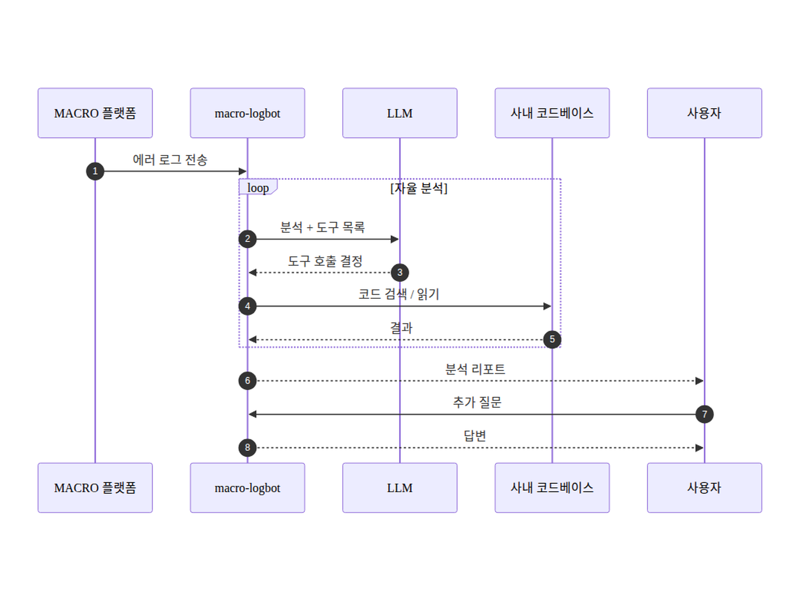

# macro-logbot — 요구사항 요약 (발표용)

**사내 테스트 플랫폼 MACRO 의 에러 로그를 받아 LLM 이 자율적으로 원인을 분석·리포트하는 사내 에이전트 AI 플랫폼**

## 한 장 정리

## 핵심 기능

- **자율 원인 분석** — LLM 이 도구를 반복 호출하며 원인 추적
- **코드 + 로그 결합** — 사내 코드베이스 검색·읽기로 정확도 향상
- **구조화 리포트** — structured JSON (원인 / 위치 / 신뢰도) 출력, OSS fallback + retry
- **모델 독립성** — env swap 만으로 다른 LLM 으로 전환
- **workspace 격리 보안** — `MACRO_LOGBOT_ENV` 게이트로 PoC/production 접근 범위 분리, symlink escape 차단

---

> 다이어그램 원본은 `01-requirements-summary.mmd` (mermaid). 수정 시 PNG 재생성 필요.
