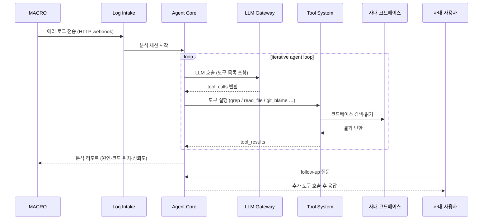

# macro-logbot — 요구사항 요약

**사내 테스트 플랫폼 MACRO의 에러 로그를 받아 LLM이 자율적으로 원인을 분석·리포트하는 사내 에이전트 AI 플랫폼**

## 핵심 기능

- **자율 원인 분석**: LLM이 도구를 반복 호출하며 에러 근본 원인 추적 (iterative agent loop)
- **코드 + 로그 결합 분석**: 사내 코드베이스 검색·읽기로 정확도 향상
- **구조화된 분석 리포트**: 원인 추정·관련 코드 위치·신뢰도 출력
- **Follow-up 대화 세션**: 리포트 생성 후 사용자가 추가 질문 이어갈 수 있음
- **모델 독립성**: LLM endpoint 설정만 교체하면 다른 모델로 전환 가능
- **사내 환경 격리**: 분석 대상 코드·로그가 사내 환경 외부로 유출되지 않음
- **에이전트 플랫폼 확장 가능**: Tool System(MCP)에 새 도구 plug-in 형태로 추가

## 사용자 시나리오 플로우

