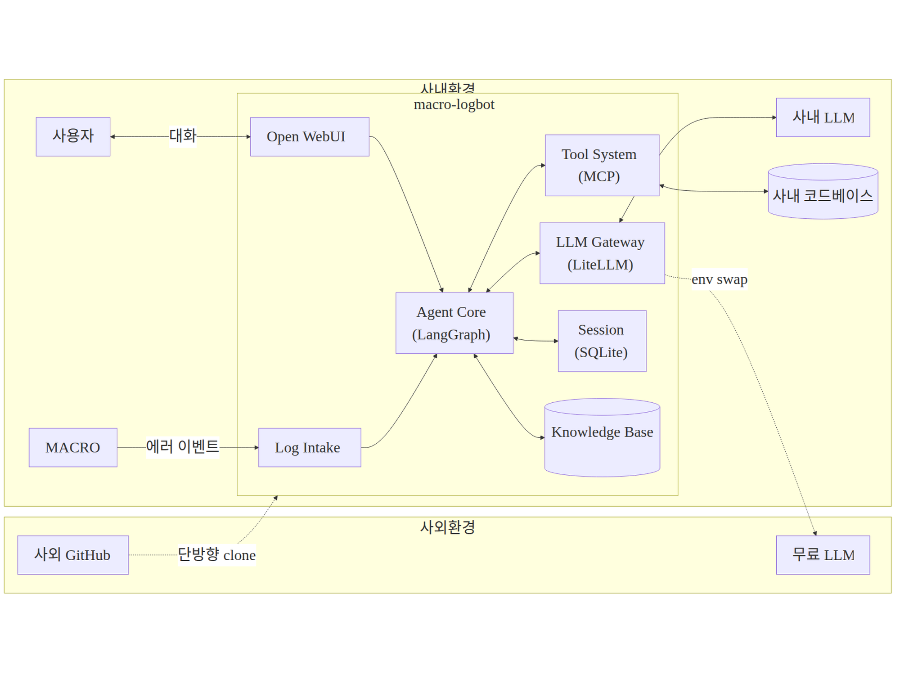

# macro-logbot — 아키텍처 다이어그램 (발표용)

**사외 GitHub 에서 개발하고 사내 환경에 단방향 clone·deploy 하는 에이전트 AI 플랫폼**

## 한 장 정리

## 컴포넌트 (한 줄씩)

- **Log Intake** — MACRO 에러 이벤트 수신
- **Agent Core** — LangGraph 6 노드 자율 분석 루프
- **LLM Gateway** — LiteLLM, 100+ 모델 추상화
- **Tool System** — MCP 9 도구 (코드·로그 검색·읽기)
- **Session / Knowledge Base** — SQLite, follow-up + 분석 결과 누적
- **Open WebUI** — 사용자 채팅 UI (Docker 격리)

---

> 다이어그램 원본은 `02-architecture-diagram.mmd` (mermaid). 수정 시 PNG 재생성 필요.
