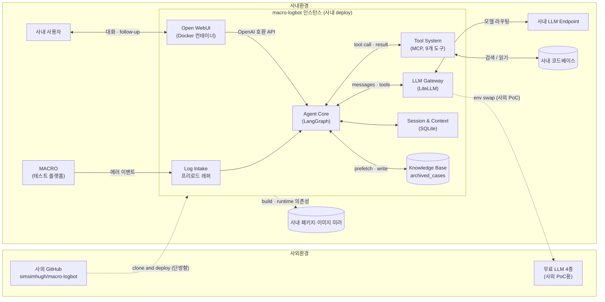

# macro-logbot — 아키텍처 다이어그램

**사외 GitHub에서 개발하고 사내 환경에 단방향 clone·deploy하는 에이전트 AI 플랫폼**

| 컴포넌트 | 핵심 책임 |
|---|---|
| Log Intake | MACRO 에러 이벤트 수신 (HTTP webhook) · 세션 초기화 |
| Agent Core | iterative tool calling 루프 · LangGraph state graph |
| LLM Gateway | LiteLLM 어댑터 · 100+ 모델 단일 인터페이스 · 모델 독립성 |
| Tool System | 사내 코드베이스 검색·읽기 9개 MCP 도구 (read-only) |
| Session & Context | 메시지 히스토리 · follow-up 컨텍스트 유지 |
| Knowledge Base | 분석 결과 자동 아카이빙 · 유사 사례 retrieval (RAG) |
| Open WebUI | 사용자 채팅 UI (Docker 격리 · Python 3.14 호환 회피) |
