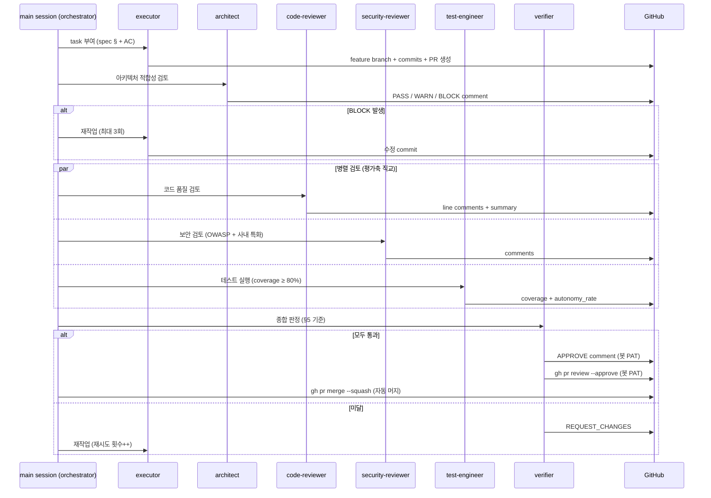

# AI DLC (AI Development Life Cycle) 플로차트

**AI sub-agent가 SDLC 각 단계마다 reviewer/executor 역할을 수행해 코드 작성부터 자동 머지까지 처리하는 개발 사이클**

## sub-agent 역할

| sub-agent | 역할 | 통과 조건 |
|---|---|---|
| **executor** | spec 기반 코드 작성 · PR 생성 · 리뷰 반영 수정 | — (작성자) |
| **architect** | 컴포넌트 책임·NFR·메타 정의 위반 여부 | BLOCK 0, WARN 처리 완료 |
| **code-reviewer** | 정확성·가독성·버그·edge case | CRITICAL/HIGH/MEDIUM 0 |
| **security-reviewer** | OWASP Top 10 + 시크릿·외부 유출 차단 | CRITICAL/HIGH/MEDIUM 0 |
| **test-engineer** | 커버리지 ≥ 80% · 기존 테스트 회귀 없음 | 3개 조건 모두 충족 |
| **verifier** | 위 4개 결과 종합 + AC 일치 + 자동 머지 실행 | 전체 통과 시 봇 approve → 자동 머지 |
