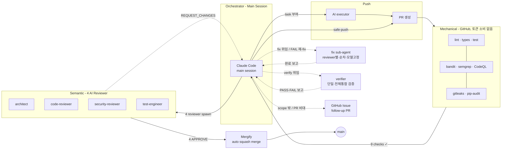

# AI DLC (AI Development Life Cycle) — v2

**Mechanical (GitHub, 토큰 소비 없음) + Semantic (AI reviewer, 토큰 사용) 분업으로 코드 작성부터 자동 머지까지 처리하는 개발 사이클**

## 한 장 정리

## 4 단계 요약

1. **Mechanical 검증** — GitHub Actions 9 checks (lint/types/test/SAST/secrets/deps) + Dependabot + Push Protection. 토큰 소비 없음.
2. **Semantic 리뷰** — architect / code-reviewer / security-reviewer / test-engineer (4 AI 병렬). GitHub 이 이미 하는 영역은 검토 금지 → 토큰 절약.
3. **Fix cycle** — REQUEST_CHANGES 시 scope 안은 reviewer별 fix sub-agent(순차·모델고정) → 단일 verifier 전체통합 검증(변경 전체를 한 번에 봄, PASS 시 main이 push), scope 밖은 GitHub Issue 로 분리 (follow-up PR).
4. **자동 머지** — 4 APPROVE + 9 CI pass → Mergify auto squash merge.

## v1 과의 차이

| | v1 | v2 |
|---|---|---|
| 판정 | verifier agent 종합 | Mergify rule (server-side) |
| 머지 | bot PAT self-approve | Mergify auto-merge |
| mechanical | 없음 | GitHub Actions 9 checks |
| 분업 | AI 가 전부 | GitHub (mechanical) + AI (semantic) |

---

> 다이어그램 원본은 `03-ai-dlc-flowchart.mmd` (mermaid). 수정 시 PNG 재생성 필요.
> v1 은 `03-ai-dlc-flowchart-v1.{md,mmd,png}` 에 보존.
